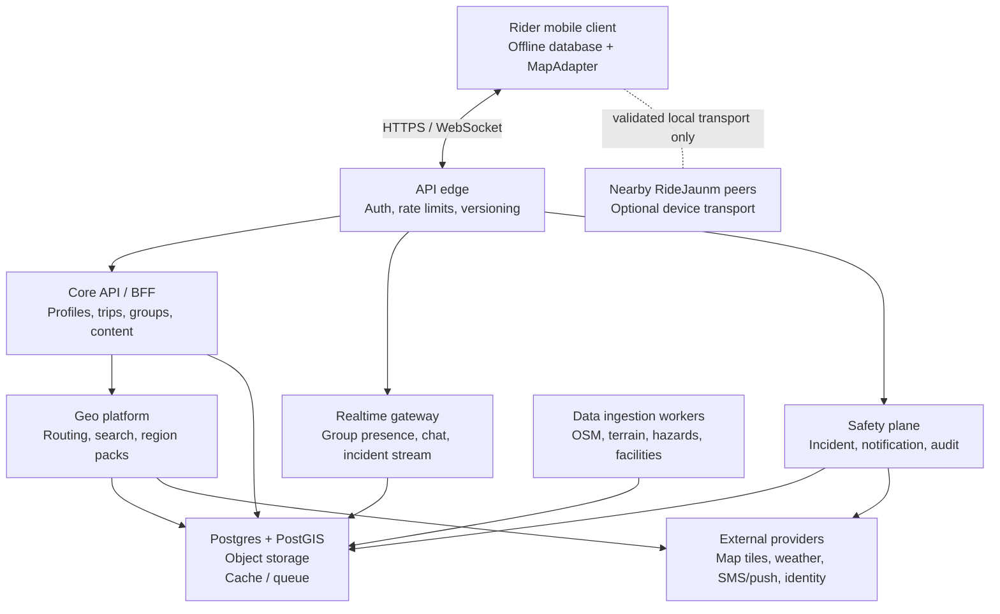
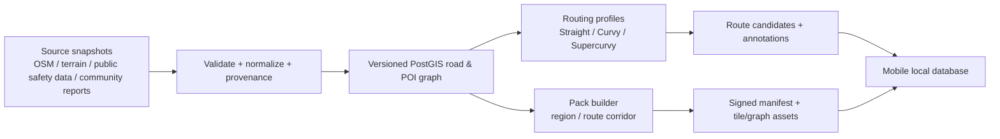

# System Design — RideJaunm

> **Audience:** product, backend, mobile, geospatial, and safety engineering.  
> **Purpose:** a buildable system contract that turns the mobile design into reliable services without overpromising emergency capability.  
> **Companion:** [React Native Design-to-Code Guidelines](10-design-to-code-react-native.md), [offline Nepal data specification](09-nepal-offline-data-spec.md), and [system task manifest](../implementation/system-design-task-manifest.md).

## 1. System goals and non-goals

### Goals

1. Make Nepal-first motorcycle route planning work online and from downloaded packs: Straight, Curvy, and Supercurvy routes, waypoints, elevation, surface, hazards, and permits.
2. Keep a ride group coordinated with truthful real-time or delayed state, privacy controls, chat, and shareable routes.
3. Allow a rider to prepare and navigate when the network fails; data freshness and coverage are first-class.
4. Let SOS use the best **verified** available transport and keep an immutable incident trail.
5. Retain a clear seam for future countries, languages, routing profiles, and providers.

### Non-goals for the first production release

- Do not build a general-purpose social network, a nationwide public-safety dispatch centre, or a bespoke global map platform.
- Do not describe a server-assisted feature as offline or mesh-capable until actual device transport has been independently tested.
- Do not make route optimization, group tracking, social feeds, or telemetry block SOS.

## 2. Design principles

- **Offline first, server enhanced.** The app owns downloaded maps, route packs, drafts, queue state and current ride recovery. The backend distributes, enriches and reconciles.
- **Truth over optimism.** Every location/delivery datum has source, accuracy, observed time, and freshness; “live” has a defined heartbeat, not an assumption.
- **Safety plane isolation.** SOS is an independently deployable, auditable, rate-protected system with no dependency on Feed/Chat availability.
- **Geospatial source of truth.** Road, hazard, region and facility data are versioned geospatial records, never blobs hidden in application JSON.
- **Regional configuration.** Country policy, emergency contacts, language, units, routing profiles and source licenses are data/configuration—not Nepal-specific branches throughout code.
- **Least location disclosure.** Precise locations are private by default, scoped to the active group/ride, short-lived, and access logged.

## 3. Context and logical architecture



### Deployment units and ownership

| Unit | Owns | Must not own |
|---|---|---|
| Mobile client | encrypted local cache, route pack use, local queue, device capability truth, UI state | provider credentials, authoritative server identity, fabricated delivery state |
| API edge | auth token validation, request IDs, versioning, idempotency/rate limits, device attestation hooks | business rules or direct data mutation |
| Core API | profiles, garage, trips, groups, posts, permissions, outbox events | route graph computation, emergency dispatch orchestration |
| Geo platform | search, route candidates, elevation/surface/hazard annotations, pack manifests, pack assembly | social and account policy |
| Realtime gateway | group-presence fan-out, ephemeral chat presence, delivery acknowledgements | durable business state without an event/outbox write |
| Safety plane | incident lifecycle, channel attempts, acknowledgement log, emergency-contact notification orchestration, audit export | community/media dependencies |
| Ingestion | source import, validation, tile/pack builds, freshness and provenance | user-facing synchronous requests |

## 4. Data architecture

Use a relational operational store with geospatial capability (for example, PostgreSQL + PostGIS), object storage for region packages/media/export artifacts, a cache for short-lived presence and route/search results, and a durable event/outbox mechanism. Backups, encryption, retention and access policy apply to each tier.

### Core entities

| Domain | Core records | Important fields / invariants |
|---|---|---|
| Identity | `user`, `device`, `consent`, `emergency_contact`, `medical_card` | emergency details encrypted; explicit sharing and retention consent; device capabilities/version |
| Geography | `country`, `admin_region`, `offline_region`, `road_segment`, `poi`, `facility`, `hazard`, `permit_zone`, `coverage_zone` | geometry + source + source version + observed/valid/fresh-until timestamps |
| Routing | `routing_profile`, `route_request`, `route_candidate`, `route_geometry`, `route_annotation`, `saved_route`, `waypoint` | candidate source version; mode; geometry checksum; hazards/permit/surface/elevation summary |
| Ride/group | `trip`, `trip_member`, `ride_session`, `location_sample`, `group_presence`, `invite` | group role Lead/Sweep/Rider; location source/accuracy/observedAt/expiry; no permanent raw trace by default |
| Social | `post`, `media_asset`, `comment`, `reaction`, `conversation`, `message`, `sync_operation` | idempotency key; moderation state; client time and server receipt time; queued status |
| Safety | `incident`, `incident_channel_attempt`, `incident_ack`, `incident_status_event`, `incident_export` | append-only status transition history; source and delivery evidence for every claim |

### Time, provenance, and freshness contract

Every imported record carries `source`, `sourceVersion`, `observedAt`, `publishedAt` when present, `ingestedAt`, `validFrom`, and `freshUntil`. Every user device report has `deviceObservedAt`, `serverReceivedAt`, `accuracyM`, and `transport` (`gps`, `mesh-relay`, `manual`, `last-known`). Never overwrite precise observations with a less precise source.

Base map packs and hazards have separate freshness clocks: hazards/closures/bandh data expire at 14 days; base offline pack UI becomes stale at 30 days and must surface the source version. A missing coverage area is `partial`, not `complete`.

## 5. API and event contract

Version public APIs under `/v1`; use OAuth/OIDC-compatible access tokens, device-scoped refresh/session management, and an `Idempotency-Key` on client write endpoints. All errors use one typed envelope:

```json
{
  "code": "OFFLINE_REGION_STALE",
  "message": "Mustang hazards need an update.",
  "requestId": "req_...",
  "retryable": true,
  "details": { "freshUntil": "2026-08-19T00:00:00+05:45" }
}
```

| Area | Essential commands/queries |
|---|---|
| Identity | `POST /auth/*`, `GET/PATCH /me`, `POST /devices`, `GET/PUT /safety-profile` |
| Routes | `POST /routes/candidates`, `POST /routes/{id}/save`, `GET /routes/{id}`, `POST /routes/{id}/share` |
| Offline | `GET /offline/regions`, `POST /offline/packs/plan`, `GET /offline/packs/{id}/manifest`, signed asset fetch, `POST /offline/packs/{id}/receipt` |
| Trips/groups | `POST /trips`, `PATCH /trips/{id}`, `POST /trips/{id}/invites`, `POST /rides`, `POST /rides/{id}/location-batch` |
| Social | `GET /feed`, `POST /posts`, media-upload intent, comments/reactions, conversations/messages |
| Safety | `POST /incidents`, `POST /incidents/{id}/channel-attempts`, `POST /incidents/{id}/acks`, `POST /incidents/{id}/stand-down` |

Use a persisted outbox for events generated with data writes. Minimum events:

```text
route.saved.v1                 offline.pack.published.v1
trip.invited.v1                ride.location.received.v1
group.presence.changed.v1      message.queued.v1
incident.created.v1            incident.channel-attempted.v1
incident.acknowledged.v1       incident.stood-down.v1
hazard.updated.v1              pack.freshness.changed.v1
```

Events are immutable, schema-versioned, correlation-ID carrying facts. Consumers must be idempotent; retries must not duplicate notifications, feed cards, or incident state changes.

## 6. Geospatial, routing, and offline-pack pipeline



### Routing contract

- All three route candidates are calculated from the same start/end/waypoints/options and a pinned graph version.
- Straight minimizes generalized time/distance; Curvy balances bend score with safety/surface constraints; Supercurvy maximizes the configured curvature score while honoring hard legal/closure/permit constraints.
- The response includes distance, duration, bends, ascent/descent, surface composition, graph version, freshness, restrictions and every hazard/uncertainty. A candidate that is impossible, unsafe, out of coverage, or unsupported is explicit with a reason.
- Route geometry is server-verifiable but usable from a downloaded routing graph when its pack supports the corridor. The client never tries to recreate a global route engine from UI state.

### Offline-pack contract

`region` and `route-corridor` packs have a manifest containing package/version/checksum, bounding geometry, zoom ranges, bytes, graph version, style/assets, POI/hazard subsets, per-layer freshness, licence/attribution, and signed URLs. Download is resumable and integrity-checked. The server accepts a receipt but client truth is display based on local verified assets, not merely a server “downloaded” flag.

Ingestion workers quarantine malformed/community-supplied data, retain reviewer/provenance state, and publish only validated build versions. The app must show source/freshness and a report mechanism for a dangerous road detail.

## 7. Realtime, sync, and privacy

### State model

- **Live group presence:** ephemeral, TTL-backed, fan-out only to active authorized trip/group members. A “last seen” timestamp is always included.
- **Ride location:** batch, dedupe, and downsample server-side. Default high-frequency retention is short; store an explicit ride trail only with user/group policy and consent.
- **Client writes:** append local `sync_operation` records with UUID, operation type, payload version, created time, retry count and state. Server responds idempotently; conflicts return enough data to display and resolve rather than silently losing a rider’s work.
- **Chat/posts:** locally queued, shown as queued/sent/failed; encrypted in transit and access controlled by group/conversation membership.

Fine location is never public by default. The API authorizes every query against active membership/visibility scope, issues short-lived media/pack URLs, logs emergency-access reads, and supports account export/deletion policy. Do not expose precise locations in generic Feed payloads.

## 8. Safety plane

The Safety plane handles lifecycle and evidence, not an assertion that emergency services have been notified.

```text
draft -> arming -> cancel_window -> active -> (acknowledged | active) -> stood_down -> closed
                         \-> cancelled
```

1. Mobile creates an incident only after the deliberate local UX completes; its payload includes user-selected/available location truth, accuracy, device time, battery, health-card consent scope and transport capability snapshot.
2. The server records `incident.created` append-only and attempts only configured server-side channels (push/SMS/voice/provider integration), each as a separate `incident_channel_attempt` with request/receipt/failure evidence.
3. Device mesh/BT/PTT relays are reported as `device-reported` until they reach the server; they may have their own peer acknowledgement but cannot be represented as emergency-service delivery.
4. Recipients acknowledge with signed/account-authenticated events. The incident UI distinguishes **sent to device**, **peer acknowledged**, **provider accepted**, and **confirmed by person**.
5. Stand-down needs deliberate client intent plus reason; the server writes All Clear to eligible contacts/channels and preserves an exportable audit timeline.

Safety availability requirements: isolated deployable, separate rate/abuse controls, multi-region data recovery plan, queue-first notifications, audit-log immutability, on-call runbook, provider failover tests, and failure-injection drills. It must degrade to a local breadcrumb/export state if every server channel is unavailable.

## 9. Security, reliability, and operations

| Area | System requirement |
|---|---|
| Authentication | short-lived access tokens, rotating refresh/session tokens, device/session revocation, rate limits and suspicious-login controls |
| Authorization | policy checks at the resource level for group, trip, media, location and incident access; no client-supplied role trust |
| Encryption | TLS in transit, KMS-managed encryption at rest, field-level protection for medical/contact data, encrypted mobile local store where platform permits |
| Abuse | separate SOS, auth, upload and route quotas; incident spam controls must not prevent a valid emergency retry; human review path |
| Audit | immutable incident transitions, privileged access reads, consent changes, source-data publishing, routing-profile changes |
| Observability | request/correlation IDs, metrics/traces/logs, PII redaction, location sampling dashboards, pack build/freshness health, channel delivery funnel |
| Availability | graceful read-only/cached client experience, queue consumers with DLQ, retries with jitter, backup/restore exercises, provider outage switches |
| Compliance | Nepal counsel review for emergency copy/data, user terms/consent, OSM attribution/ODbL obligations, data-retention and deletion policy before launch |

### Service indicators

- Route: candidate success/latency by profile/region/graph version; excluded/restriction rate.
- Offline: pack build success, manifest integrity failure, download completion, stale/partial coverage.
- Realtime: active members, delivery lag, reconnect rate, stale-presence rate.
- Safety: arm-to-create time, channel acceptance/acknowledgement ratio, duplicate suppression, stand-down latency, provider failure rate. Never measure “rescues” as a product conversion metric.

## 10. Phased delivery and decision gates

| Phase | Deliverable | Gate |
|---|---|---|
| S0 | ADRs, threat model, contracts, local fixtures | unknown providers and policy choices explicitly open |
| S1 | identity/core/trip/route read model, MapAdapter fixtures | end-to-end planned ride works with fake services |
| S2 | Nepal graph ingestion, candidate routing, offline pack pipeline | versioned/validated pack downloaded and used offline |
| S3 | group presence, messaging queue, social sharing | privacy, stale state and reconnect tests pass |
| S4 | Safety plane UI/API, audit, configured notification integration | failure injection and independent safety review pass |
| S5 | scale, backups, monitoring, country configuration | load, restore, privacy, and on-call drills pass |

Before implementation, create ADRs for: map tile/routing engine; authentication/identity; push/SMS provider; local-store encryption; cloud/region; event transport; media moderation; retention; and which safety transports are actually in scope. Do not let an agent choose paid providers or dispatch integrations without user authority.
