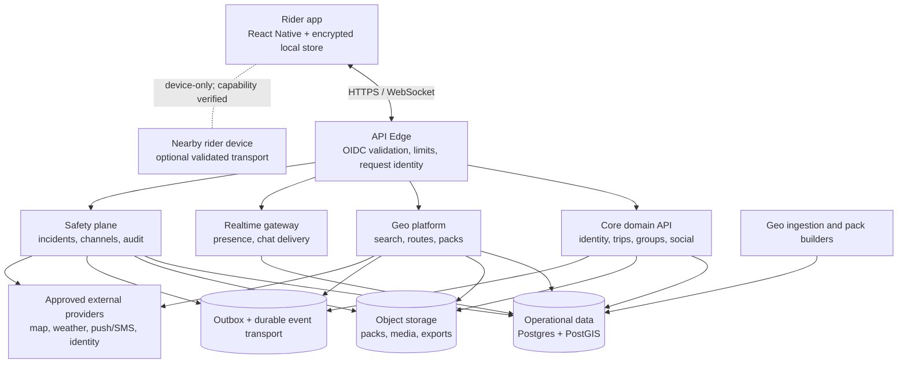
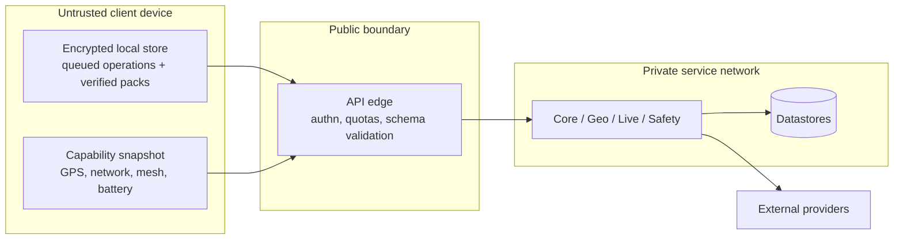
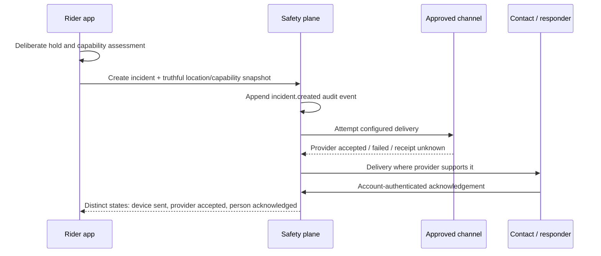

# RideJaunm System HLD — High-Level Design

> **Status:** implementation baseline.  
> **Audience:** product, architecture, mobile, backend, geospatial, security, and operations.  
> **Companion:** [system contract](11-system-design.md), [LLD](13-system-lld.md), and [system build manifest](../implementation/system-design-task-manifest.md).

## 1. Purpose and scope

RideJaunm is a Nepal-first, offline-first motorcycle trip platform. It plans three route styles (Straight, Curvy, Supercurvy), distributes verified map packs, coordinates private groups, supports community features, and records a safety incident with truthful delivery evidence.

This HLD defines **system boundaries, ownership, trust boundaries, data movement, and deployment qualities**. It does not select paid providers, promise an untested satellite/mesh capability, or replace the detailed API/data design in the LLD.

### Architectural outcomes

1. A downloaded pack can support map and eligible route-corridor use with no network.
2. Realtime is explicitly fresh, stale, delayed, or unavailable—never implied live.
3. The safety plane can operate and be audited independently of feed, chat, or route services.
4. Nepal policy and data are configuration-driven, allowing later country expansion.
5. Every write is recoverable and idempotent; every sensitive access is authorized and auditable.

## 2. System context

## 3. Bounded contexts and ownership

| Boundary | Responsibility | Owns | Cannot depend on synchronously |
|---|---|---|---|
| Mobile client | local experience and truthful capability state | local packs, queue, drafts, recovered ride state | a network response for cached/offline use |
| API edge | ingress policy | token verification, rate limits, request/correlation IDs | domain writes or direct storage mutation |
| Identity & consent | account/device safety boundary | user, device, consent, emergency profile, audit policy | social, routing, media availability |
| Trip & group | planned/active ride coordination | trips, membership, invitations, saved routes, ride sessions | live fan-out for durable writes |
| Geo platform | Nepal map intelligence | search, graph versions, candidates, annotations, pack manifests | feed/chat policy |
| Realtime | short-lived delivery | authorized channels, presence TTL, acknowledgement fan-out | durable state without an outbox event |
| Community | private social interaction | posts, media intents, conversations, messages, moderation state | safety availability |
| Safety plane | incident lifecycle | incidents, channel attempts, acknowledgements, immutable audit export | community or media services |
| Ingestion | trusted source publication | normalization, validation, quarantine, build provenance | user-facing request path |

## 4. Trust and data boundaries

- The app is not trusted to claim a role, an incident delivery, a provider receipt, or a geo-data publication.
- A precise location is private by default and must be checked against current membership/visibility policy at read time.
- Medical and emergency-contact data uses field-level protection and is accessed only for the declared safety purpose.
- Pack/media URLs are short-lived, scope-limited, and recorded in an audit trail when they expose protected resources.
- Community reports and external geographic sources stay quarantined until validation and provenance checks pass.

## 5. Major data flows

### 5.1 Route planning and offline use

1. Client submits start, destination, waypoints, rider preferences, and a country/profile context.
2. Geo platform pins a graph version and returns explicit candidate states for Straight, Curvy, and Supercurvy, including restrictions, coverage, and freshness.
3. Client may save the selected candidate and request a region or route-corridor pack plan.
4. Pack builder publishes a signed manifest with checksum, graph/version, attribution, layer freshness, and resumable assets.
5. Client verifies assets locally and records a receipt. UI truth comes from locally verified assets—not merely a server flag.

### 5.2 Group ride coordination

1. Core service authorizes membership and creates an active ride session.
2. Device batches location observations with source, accuracy, device observed time, and transport.
3. Realtime gateway fans out only authorized, TTL-bounded presence. It includes `lastSeenAt` and stale state.
4. Durable ride/session changes use transactional storage plus an outbox. A reconnect replays client operations idempotently.

### 5.3 Safety incident lifecycle

No component may collapse these states into “help is coming.” Device-to-device relay remains `device-reported` until it reaches a verified backend channel.

## 6. Deployment model

The implementation may start as a modular deployment, but logical boundaries and independent scaling/failure isolation must remain intact.

| Unit | Scale / availability concern | Data responsibility |
|---|---|---|
| Edge | burst protection, schema/version routing | no primary domain data |
| Core domain API | normal transactional workload | relational data + transactional outbox |
| Geo API/workers | CPU/memory-heavy routing and build jobs | PostGIS, graph registry, pack manifests |
| Realtime gateway | many long-lived connections | ephemeral presence plus durable outbox-backed events |
| Safety plane | independent deploy/recovery and priority queues | incident ledger and channel attempts |
| Worker pool | retry/DLQ isolation and back-pressure | ingestion, manifests, notifications, exports |
| Data plane | encryption, backup/restore, regional policy | relational, object, cache, event retention |

Safety queues, quotas, provider credentials, dashboards, and runbooks are isolated from social/community workloads. External map, SMS/push, identity, weather, and routing providers are adapter interfaces; their selection requires an ADR and user authority.

## 7. Reliability and failure strategy

| Failure | System behaviour |
|---|---|
| No network | app remains usable from verified packs/cached state; writes queue with visible status |
| Pack asset failure | retain verified partial assets; show missing coverage; retry resumably; never label complete |
| Geo provider failure | use cached/pack-supported result when safe; otherwise return an explicit unavailable candidate |
| Realtime disconnect | reconnect with backoff; label members stale from TTL; replay idempotent operations |
| Duplicate client write | idempotency key returns prior result, without duplicate messages/notifications/incident transitions |
| Safety provider outage | record channel failure, fail over only to configured channels, preserve local and server audit trail |
| Service or storage failure | use retries with jitter, DLQ, restore exercises, and read-only/cached degradation where appropriate |

## 8. Non-functional design targets

| Quality | Architecture control |
|---|---|
| Security | short-lived access tokens, device sessions, policy enforcement, key management, PII-redacted logs |
| Privacy | least location disclosure, explicit consent, scoped visibility, retention/deletion/export workflows |
| Correctness | versioned schemas, idempotency, outbox, provenance/freshness, immutable incident transitions |
| Availability | offline-capable client, independent safety plane, queue-first work, backups and failure drills |
| Observability | correlation IDs, traces, metrics, structured logs, pack/safety/realtime dashboards |
| Accessibility/localization | English, Nepali, Hindi content contracts; Nepal `+05:45`; AD/BS support at presentation boundary |
| Cost control | regional pack generation, cacheable reads, TTL-bound presence, quota tiers, async processing |

## 9. Decision gates before production scope

The following remain explicit ADR decisions, not implementation assumptions:

1. map tiles, route engine, graph build, and licence/attribution model;
2. identity provider and device-session model;
3. cloud region, encryption/key management, backup and recovery targets;
4. event transport and realtime technology;
5. mobile encrypted-store and device-capability validation approach;
6. media moderation/storage policy and retention/deletion rules;
7. approved safety providers and exactly which delivery evidence each can return;
8. Nepal legal review for emergency wording, contact data, and public-safety claims.

## 10. Delivery mapping

| HLD area | Build-manifest tasks |
|---|---|
| Decisions, risks, contracts | S0–S1 |
| Data, identity, trips, durable eventing | S2–S4 |
| Geo graph, route candidates, packs | S5–S7 |
| Presence, sync, community | S8–S9 |
| Safety lifecycle and providers | S10–S11 |
| Operations and country expansion | S12–S13 |

Implementation may begin only with the relevant decision gates recorded. The corresponding low-level contracts are in the [LLD](13-system-lld.md).
