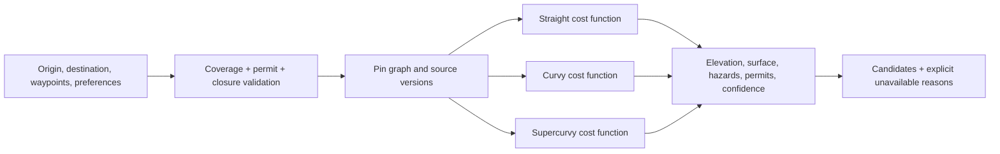
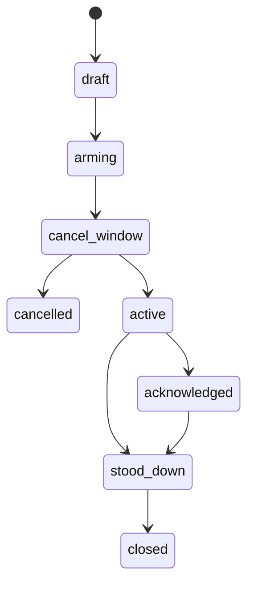

# RideJaunm System LLD — Low-Level Design

> **Status:** implementation baseline; provider-neutral by design.  
> **Companion:** [HLD](12-system-hld.md), [system contract](11-system-design.md), and [system build manifest](../implementation/system-design-task-manifest.md).

## 1. Implementation shape

Deployable modules may initially share a repository/runtime, but communicate through explicit interfaces and schema-versioned events. No synchronous request may cross into the safety plane from community/feed code.

```text
apps/
  edge/                 request ID, authn, rate/version policy
  core-api/             identity, trips, groups, social, outbox
  geo-api/              search, route candidates, manifests
  realtime-gateway/     authorized WebSocket channels and TTL presence
  safety-api/           incidents, channel attempts, acknowledgements
  workers/              ingestion, pack, notification, export, moderation
packages/
  contracts/            OpenAPI/JSON Schema + event schemas
  authz/                resource policy functions
  geo-domain/           routing profile and annotation rules
  safety-domain/        state machine and evidence model
  observability/        correlation, audit and redaction helpers
```

## 2. Domain modules and interfaces

| Module | Commands | Read models / events |
|---|---|---|
| Identity | register device, revoke session, update consent, update safety profile | device capability, consent audit; `device.registered.v1`, `consent.changed.v1` |
| Trip/group | create/update trip, invite, join/leave, start/end ride | membership and ride state; `trip.invited.v1`, `ride.started.v1` |
| Geo | route candidates, save/share route, plan/publish pack | candidate, graph/pack freshness; `route.saved.v1`, `offline.pack.published.v1` |
| Sync/realtime | location batch, presence heartbeat, message delivery acknowledgement | ephemeral presence and delivery state; `ride.location.received.v1`, `group.presence.changed.v1` |
| Community | post, media-upload intent, comment/reaction, queue message | moderated feed/conversation; `message.queued.v1` |
| Safety | create incident, record channel attempt, acknowledge, stand down | immutable timeline/export; `incident.*.v1` |

All command handlers take `actor`, `requestId`, `idempotencyKey`, schema version, and observed-time metadata. They validate authorization before mutation and write an outbox record in the same database transaction.

## 3. Storage model

### 3.1 Common columns

Every mutable relational record includes `id` (UUID), `created_at`, `updated_at`, `version`, and appropriate `created_by`/`updated_by`. Imported geography additionally requires:

```text
source, source_version, observed_at, published_at,
ingested_at, valid_from, fresh_until, review_state
```

Device observations use both `device_observed_at` and `server_received_at`. Never replace a precise observation with a less precise source.

### 3.2 Core relational records

| Table | Primary fields and constraints |
|---|---|
| `users` | account identity, locale, country configuration key, account state |
| `devices` | `user_id`, platform/app version, capability JSON, last attested time, revoked time |
| `consents` | subject, purpose, policy version, granted/revoked times; append-only audit |
| `emergency_contacts`, `medical_cards` | encrypted protected fields; access-purpose audit required |
| `trips`, `trip_members`, `invites` | membership uniqueness; role in `lead/sweep/rider`; invitation expiry |
| `ride_sessions` | active state, selected route/pack, started/ended time; only one active ride per rider policy |
| `location_samples` | `ride_id`, accuracy, source, transport, observed/received time; partition/retain by policy |
| `routing_profiles`, `route_requests`, `route_candidates`, `route_geometries`, `route_annotations` | candidate graph version and geometry checksum are immutable after publication |
| `offline_regions`, `offline_packs`, `pack_assets`, `pack_receipts` | manifest version/checksum; receipt does not imply client verification |
| `posts`, `media_assets`, `comments`, `reactions`, `conversations`, `messages` | author/member policy, moderation state, client/server timestamps, idempotency key |
| `incidents`, `incident_status_events`, `incident_channel_attempts`, `incident_acks` | append-only lifecycle/evidence; no destructive update of a historical state |
| `outbox_events`, `sync_operations`, `audit_log` | unique event/operation idempotency keys; correlation and causation IDs |

### 3.3 Geospatial records

Use PostGIS geometry/geography with declared SRID and spatial indexes for `admin_regions`, `offline_regions`, `road_segments`, `pois`, `facilities`, `hazards`, `permit_zones`, and `coverage_zones`.

`road_segments` contains graph/version membership, legal access, surface, curvature/elevation-related attributes, and provenance. `hazards` carries severity, effective interval, source/review state, and `fresh_until`. Queries must include graph and freshness versions in their response.

### 3.4 Retention and protected data

- Presence is TTL-backed; expired presence is not “live.”
- Raw high-frequency location is retained only by declared ride/group policy; aggregated ride summaries are separate records.
- Medical/contact data, incident export, and privileged location reads have purpose-bound audit entries.
- Object storage contains packs, media, and exports only; metadata, authorization, checksum, and retention state stay in relational records.

## 4. API conventions

### 4.1 Common request/response rules

- APIs are versioned under `/v1`.
- Write endpoints require `Idempotency-Key`; duplicate requests return the original accepted result.
- Every response has `X-Request-Id`; events copy it as `correlationId`.
- Cursor pagination is required for feeds, messages, regions, and audit timelines.
- All errors use `code`, `message`, `requestId`, `retryable`, and safe `details`.

```json
{
  "code": "ROUTE_PROFILE_UNAVAILABLE",
  "message": "Supercurvy is not available for this corridor.",
  "requestId": "req_01...",
  "retryable": false,
  "details": { "reason": "coverage_or_restriction" }
}
```

### 4.2 Endpoint inventory

| Area | Endpoint | Important behaviour |
|---|---|---|
| Identity | `POST /v1/devices`, `GET/PATCH /v1/me`, `GET/PUT /v1/safety-profile` | device/session and consent policy enforced |
| Routes | `POST /v1/routes/candidates`, `POST /v1/routes/{id}/save`, `GET /v1/routes/{id}` | all modes derived from one request + pinned graph version |
| Offline | `GET /v1/offline/regions`, `POST /v1/offline/packs/plan`, `GET /v1/offline/packs/{id}/manifest`, `POST /v1/offline/packs/{id}/receipt` | signed asset URLs, manifest checksum, explicit partial/stale state |
| Trips | `POST /v1/trips`, `PATCH /v1/trips/{id}`, `POST /v1/trips/{id}/invites`, `POST /v1/rides` | membership policy and transactional outbox |
| Location | `POST /v1/rides/{id}/location-batch` | accepts source/accuracy/observed time; validates ride membership |
| Community | `GET /v1/feed`, `POST /v1/posts`, media-upload intent, conversation/message endpoints | authorization plus queued/failed states |
| Safety | `POST /v1/incidents`, `POST /v1/incidents/{id}/channel-attempts`, `POST /v1/incidents/{id}/acks`, `POST /v1/incidents/{id}/stand-down` | append-only evidence and explicit delivery claims |

## 5. Event and outbox contract

```json
{
  "eventId": "uuid",
  "name": "incident.channel-attempted.v1",
  "occurredAt": "2026-08-19T12:34:56Z",
  "correlationId": "req_01...",
  "causationId": "uuid-or-request-id",
  "actor": { "type": "user|service", "id": "uuid" },
  "data": { "schemaVersion": 1 }
}
```

Outbox publisher workflow:

1. Command handler validates payload, policy, and idempotency key.
2. It writes aggregate changes and `outbox_events` in one transaction.
3. Publisher leases unpublished rows, publishes once-or-more, and marks receipt.
4. Consumers deduplicate by `eventId`, persist their own effect idempotently, and send failures to a DLQ with correlation context.

Required event families are `route.saved.v1`, `offline.pack.published.v1`, `trip.invited.v1`, `ride.location.received.v1`, `group.presence.changed.v1`, `message.queued.v1`, `incident.created.v1`, `incident.channel-attempted.v1`, `incident.acknowledged.v1`, `incident.stood-down.v1`, `hazard.updated.v1`, and `pack.freshness.changed.v1`.

## 6. Geospatial routing and pack internals

### 6.1 Candidate pipeline



- Straight minimizes generalized duration/distance.
- Curvy trades moderate bend score against surface, safety, legal, and closure constraints.
- Supercurvy maximizes configured curvature while honoring every hard restriction; it may be unavailable and must return a reason.
- Candidate responses include graph version, geometry checksum, distance/duration, ascent/descent, surface composition, restriction/hazard list, and freshness.

### 6.2 Pack builder

1. Resolve either a named offline region or a buffered route corridor against a graph version.
2. Generate tiles/styles, routing graph subset where supported, POIs, hazards, permit/coverage data, and attribution/licence metadata.
3. Store immutable assets by content checksum.
4. Publish a versioned manifest with bounding geometry, zoom ranges, bytes, graph/style/source versions, layer freshness, checksums, and short-lived signed URLs.
5. Client download manager verifies each checksum, resumes individual assets, and reports a receipt. A missing layer produces `partial`; fresh base map does not make fresh hazards.

## 7. Sync and realtime internals

### 7.1 Client sync operation

```text
sync_operation {
  id: UUID,
  operation_type: string,
  payload_version: integer,
  idempotency_key: string unique,
  created_at, retry_count,
  state: queued | sending | accepted | failed | conflict
}
```

Client retries in order where the operation type requires ordering; independent operations may run concurrently. Server conflict responses return current server state and a resolution code. The UI always shows queued, sent/accepted, failed, or conflict rather than optimistically claiming completion.

### 7.2 Presence protocol

`presence.heartbeat` contains authorized ride/group context, location capability, last observation metadata, and sequence number. Gateway validates membership, sets TTL, and fans out a `presence.updated` payload only to eligible members. Consumers mark state stale once heartbeat age exceeds the configured threshold; expired entries are removed rather than shown as live.

## 8. Safety-plane state machine



### Rules

- `POST /incidents` may move `cancel_window → active` only after the deliberate client interaction is complete and includes a capability/location snapshot.
- The server creates `incident.created` and each `incident_channel_attempt` as separate immutable records. A channel attempt carries provider, target class, attempt time, result (`accepted`, `failed`, `unknown`), safe receipt reference, retry/failover relation, and error category.
- Device relay evidence is not provider delivery evidence. The client can report peer acknowledgement, but it remains distinct from a person acknowledgement or provider acceptance.
- An acknowledgement includes authenticated actor, timestamp, channel, and optional statement; it never mutates a prior event.
- Stand-down requires deliberate intent and reason; it creates a status event then eligible all-clear channel attempts.
- The presentation model derives labels exactly: `device_sent`, `peer_acknowledged`, `provider_accepted`, `person_confirmed`, `delivery_failed`, or `delivery_unknown`.

## 9. Authorization matrix

| Resource/action | Required policy |
|---|---|
| Read member location | active group/ride membership plus visibility/consent scope |
| Submit location batch | active ride membership; actor owns device/session |
| Invite/manage trip | trip lead or scoped organizer permission |
| Read/write conversation | conversation membership and moderation state |
| Request media URL | authorized post/conversation visibility; short expiry |
| Create incident | authenticated rider with safety profile/capability validation; emergency retry quota |
| Read incident/audit | incident subject, authorized recipient, or audited privileged role |
| Publish geographic source | ingestion/reviewer service only |

All checks are server-side resource policies. Role values from the client are input for validation only, not authority.

## 10. Observability and operational design

| Signal | Required dimensions |
|---|---|
| API | route, status/code, request ID, actor class, country, client version |
| Geo | profile, region, graph version, candidate outcome, latency, restriction cause |
| Packs | region/corridor, build version, bytes, checksum failures, stale/partial state |
| Realtime | connection/reconnect, active members, presence age, fan-out lag |
| Safety | arm-to-create, channel type/result, ack/stand-down latency, duplicate suppression, provider failover |
| Data/worker | queue age, retry count, DLQ size, ingestion quarantine, backup/restore evidence |

Logs must redact tokens, coordinates, medical data, contact data, and provider secrets. Incident and privileged-data access have a dedicated immutable audit stream. Runbooks cover route/pack degradation, provider outage, SOS queue backlog, data restore, and suspected privacy exposure.

## 11. Test matrix and implementation order

| Build task | Minimum proving test |
|---|---|
| S0–S1 | ADRs and schema/API contract tests; invalid version/idempotency cases |
| S2–S4 | migration/restore, authorization, transactional outbox, retry/duplicate writes |
| S5–S7 | malformed data quarantine, pinned graph candidates, resumable/integrity/stale packs |
| S8–S9 | membership/TTL/stale presence, reconnect/deduplication, queued social writes |
| S10–S11 | immutable incident lifecycle, no false delivery label, provider failure/retry/failover evidence |
| S12–S13 | dashboards/alerts, load/failure drills, Nepal configuration without hard-coded product branches |

Implement in manifest order. Any provider integration, native device transport, or legal/emergency claim remains feature-flagged until independently tested and approved.
