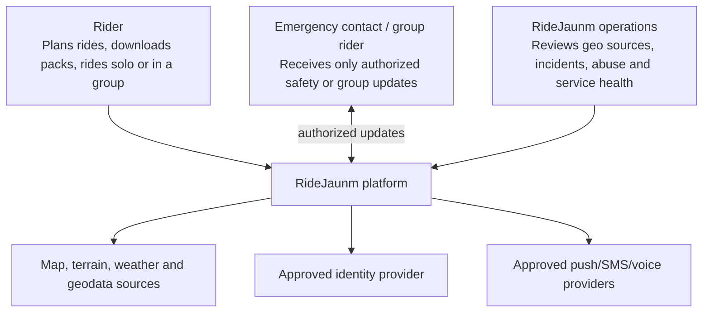
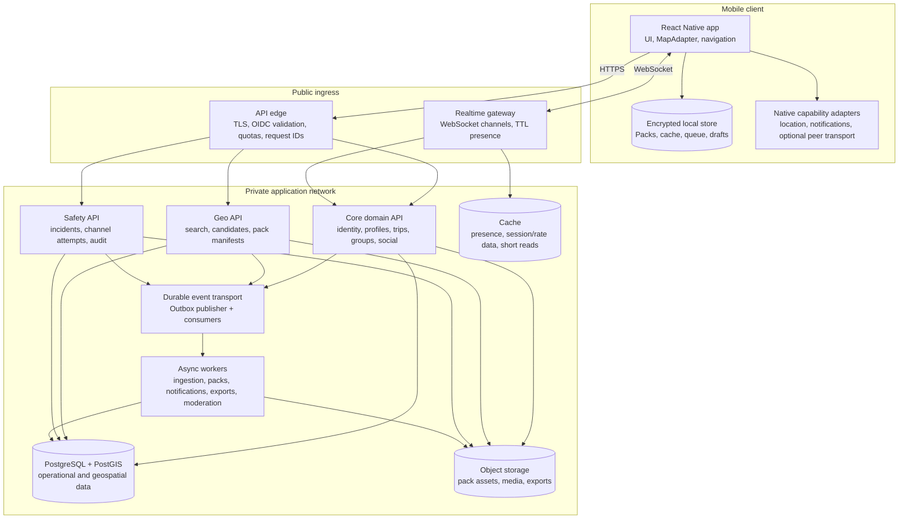
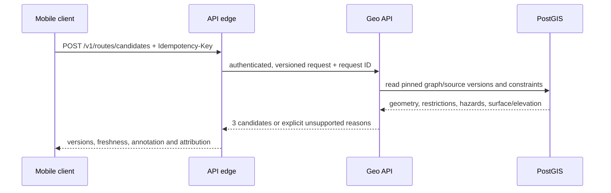
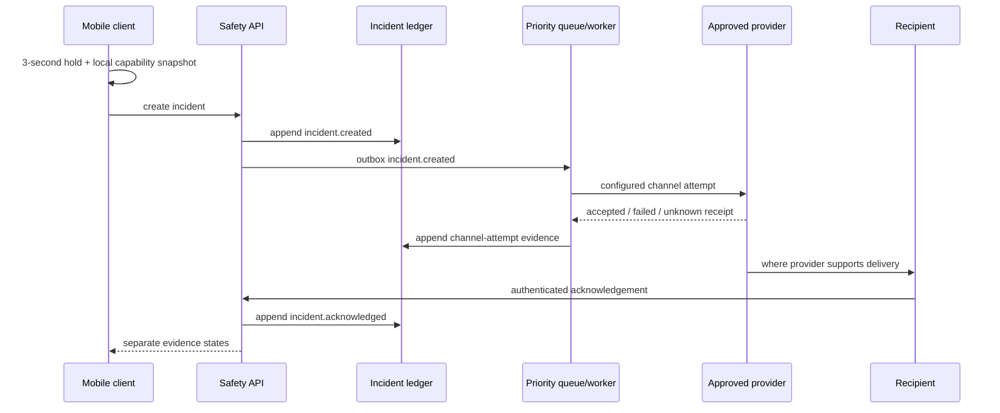
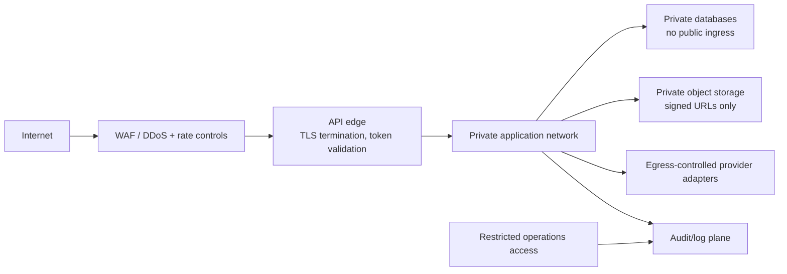
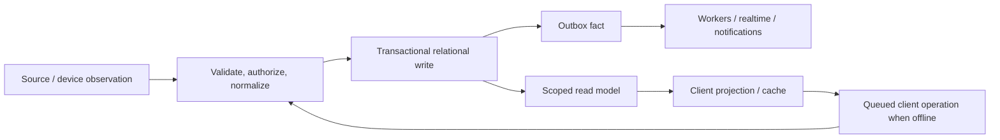
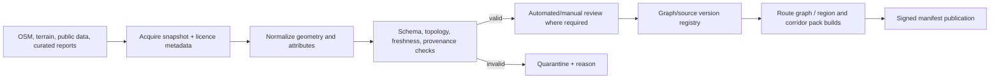
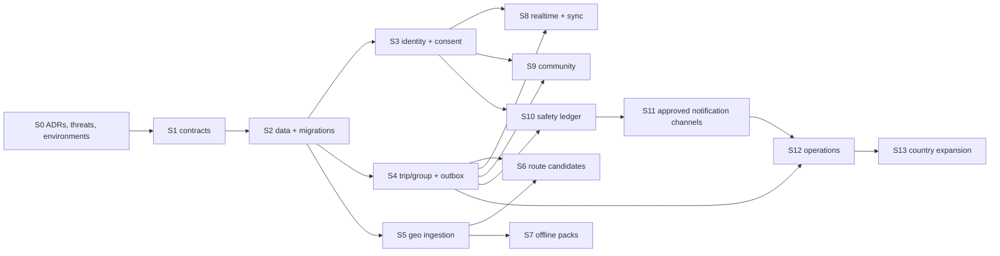

# RideJaunm Full System Architecture

> **Status:** architecture baseline for implementation and operational planning.  
> **Audience:** product, solution architecture, mobile, backend, geospatial, security, and operations.  
> **Read with:** [System HLD](12-system-hld.md), [System LLD](13-system-lld.md), [system contract](11-system-design.md), and [system build manifest](../implementation/system-design-task-manifest.md).

## 1. Architecture intent

RideJaunm is an offline-first, Nepal-first motorcycle riding platform. It must make accurate distinctions between cached, fresh, stale, queued, device-reported, provider-accepted, and person-confirmed state. The architecture therefore prioritizes local resilience, geospatial provenance, privacy, and safety isolation over feature coupling.

### System guarantees

| Guarantee | Architectural mechanism |
|---|---|
| Offline does not become an error state | verified local packs, encrypted local store, sync queue, explicit coverage/freshness model |
| Route options stay explainable | pinned graph version, candidate annotations, restriction/hazard provenance |
| Group state stays honest | authorized, TTL-backed presence with `lastSeenAt`, source and accuracy metadata |
| A write survives unreliable networks | client idempotency keys, server transactional outbox, retry/DLQ processing |
| SOS never overclaims delivery | isolated incident ledger, per-channel evidence, distinct device/provider/person states |
| Nepal-first does not mean Nepal-hardcoded | country, language, calendar, policy, routing, and provider configuration models |

## 2. C4 level 1 — system context

The platform provides route planning, offline maps, private ride coordination, community tools, and a safety incident workflow. It does not act as a public emergency-dispatch service and must not claim to notify a real-world responder without verified provider evidence.

## 3. C4 level 2 — containers

## 4. Container responsibilities and scaling

| Container | Primary responsibility | Scaling characteristic | Failure boundary |
|---|---|---|---|
| React Native app | local experience, truthful state, queued work | independently distributed iOS/Android builds | retains viable cached/offline state |
| API edge | authenticated HTTP ingress and policy prechecks | request-rate driven | no durable business mutation |
| Core domain API | transactional account/trip/group/community commands | normal API workload | not required for map rendering from an existing pack |
| Geo API | route/search/manifest reads and route-candidate computation | CPU/memory and geography workload | separate from social/safety workloads |
| Realtime gateway | authorized channels, presence and delivery fan-out | connection-count driven | absence makes state stale; it does not corrupt durable state |
| Safety API | incident lifecycle and channel evidence | priority and independently deployable | must remain independent of feed/chat APIs |
| Async workers | ingestion, pack build, notifications, exports | queue-depth and job class driven | failures retry or enter DLQ with correlation context |
| Relational/geospatial store | source-of-truth transactions and spatial queries | storage/IO/replica driven | restore-tested, encrypted, access controlled |
| Object storage | immutable assets and large objects | byte/egress driven | manifest/checksum protects clients from partial objects |

## 5. Runtime request paths

### 5.1 Online route planning

### 5.2 Offline pack download

1. Client calls pack planning with a region or route corridor and required layers.
2. Geo API resolves an eligible graph/build version, then returns a manifest identifier.
3. Client fetches a signed manifest and short-lived signed asset URLs.
4. Client resumes asset downloads and checks each content checksum.
5. Verified assets become locally usable; missing assets result in `partial`, never `complete`.
6. Client sends a non-authoritative receipt for support/telemetry; the local verification result remains UI truth.

### 5.3 Group location and presence

1. A device takes a location observation with accuracy, transport, device-observed time, and ride context.
2. It queues or batches the write; API checks active ride membership and source payload validity.
3. Core commits durable permitted data and an outbox fact.
4. Realtime gateway stores/refreshes authorized presence with TTL and distributes an update only to eligible members.
5. Recipients render live, delayed, stale, or unavailable based on observation and heartbeat age.

### 5.4 SOS incident

## 6. Network and security architecture

### Security controls

- TLS is mandatory in transit; secrets and database credentials are stored in a managed secret mechanism.
- OIDC-compatible access tokens are short-lived. Refresh/session tokens are device-scoped and revocable.
- Request authentication, authorization, schema validation, rate limiting, and correlation IDs occur before domain mutation.
- Resource policy evaluates the user, device, trip/group membership, visibility, consent, and purpose—not client-supplied roles.
- Protected contact/medical fields receive field-level encryption and purpose-bound audit logging.
- Logs, traces, and analytics redact coordinates, tokens, medical data, contact data, and provider secrets.
- Pack/media access uses short-lived scoped URLs. Objects cannot be listed publicly.
- Safety, auth, upload, and route APIs have distinct abuse-control policies; emergency retry policy is conservative enough to avoid blocking a genuine retry.

## 7. Data architecture

### 7.1 Source-of-truth allocation

| Data class | Authoritative store | Cache/local projection | Key rule |
|---|---|---|---|
| User/device/consent | relational store | encrypted client projection | server policy is authoritative |
| Trips and membership | relational store | client cached read model | membership is evaluated server-side |
| Route graph/hazards | PostGIS + graph/manifest registry | versioned downloaded subset | every response carries provenance/freshness |
| Offline assets | object storage + manifest metadata | locally checksum-verified pack | receipt is not a verification claim |
| Presence | TTL cache + optional durable sample | display cache | expired is stale/unavailable, not live |
| Social/media | relational metadata + object assets | sync queue/cache | membership/moderation policy on each access |
| Safety incident | append-only relational ledger | local timeline/cache | each delivery claim needs evidence |

### 7.2 Data lifecycle

All user writes use an idempotency key. Durable events are created in the same transaction as their source record. Consumers deduplicate by event ID and preserve correlation/causation IDs.

### 7.3 Retention and backup

- Define location, message, media, incident, and audit retention schedules as policy/ADR inputs before production.
- Retain only the raw location accuracy/frequency needed for the approved ride/group purpose; default public exposure is none.
- Back up relational and object metadata/data on a documented schedule; test point-in-time or equivalent restore before release.
- Use immutable incident/audit records with separate retention/export access policy.
- Verify a restore can recover graph/pack manifest relationships, not merely database rows or objects independently.

## 8. Eventing and asynchronous design

| Event producer | Event examples | Consumer effect |
|---|---|---|
| Core | `trip.invited.v1`, `ride.location.received.v1`, `message.queued.v1` | notification intent, realtime fan-out, sync reconciliation |
| Geo | `route.saved.v1`, `offline.pack.published.v1`, `hazard.updated.v1`, `pack.freshness.changed.v1` | cache invalidation, client availability notice, audit |
| Safety | `incident.created.v1`, `incident.channel-attempted.v1`, `incident.acknowledged.v1`, `incident.stood-down.v1` | priority delivery workflow, timeline, audit export |

### Delivery rules

1. Domain write and outbox record commit atomically.
2. Publisher delivery is at-least-once; consumer handling is idempotent.
3. Retry is bounded with jitter and a retryable/non-retryable classification.
4. Poisoned jobs enter a DLQ with event ID, attempt history, and correlation ID.
5. Safety events use dedicated priority capacity and cannot be starved by media, feed, or pack jobs.

## 9. Geographic ingestion architecture

No community or external report appears in an eligible route/pack until its source, version, review state, validity interval, and freshness are known. Pack builders use immutable graph versions; a closure or hazard update may create a newer annotation/freshness layer without silently altering a rider’s historical candidate.

## 10. Availability, resilience, and disaster recovery

| Scenario | Expected design response | Evidence before production |
|---|---|---|
| User loses cellular data | client reads verified offline pack and queues writes visibly | device flight-mode test on a downloaded Nepal region |
| Partial/corrupt pack | checksum failure, resumable retry, explicit missing coverage | interrupted download/integrity test |
| Realtime node loss | client reconnects; old presence becomes stale from TTL | reconnect and stale-marker test |
| Geo-service/provider outage | cached/offline route use where eligible; explicit unavailable result otherwise | dependency failure injection |
| Worker backlog | priority queues, age alerts, DLQ and replay control | load/back-pressure drill |
| Primary data fault | documented recovery procedure and tested restore | restore exercise with application validation |
| Safety provider outage | channel failure evidence plus configured failover; never false success | provider failure/failover simulation |

Service-level targets, recovery objectives, provider commitments, and regions must be defined in ADRs once product and budget authority exist. Until then, no numeric SLA is implied by this document.

## 11. Observability architecture

Every inbound request begins a correlation ID. It flows through API logs, traces, outbox events, worker jobs, provider attempts, and audit records.

| Domain | Core measures |
|---|---|
| API | latency/error by route, code, client version, country configuration |
| Routing | candidate latency/success by profile, graph version, region and restriction cause |
| Packs | build result, manifest integrity, download completion, partial/stale rate |
| Realtime | connections, reconnects, fan-out lag, presence age, stale rate |
| Safety | arm-to-create, duplicate suppression, channel attempt result, acknowledgement/stand-down latency |
| Operations | queue age, DLQ size, backup freshness, restore result, provider availability |

Dashboards and alerts must use safe aggregates. They may never expose a rider’s precise location, emergency details, or medical information to routine operational users.

## 12. Environments and delivery controls

| Environment | Purpose | Data rule |
|---|---|---|
| Local | contract/unit/integration development | synthetic fixtures only |
| Development | shared contract and service integration | synthetic or sanitized data |
| Staging | production-like integration and failure drills | no unapproved live safety contacts/providers |
| Production | approved rider service | policy-governed live data and audited access |

Required delivery gates:

1. Contract tests validate OpenAPI/event schema compatibility.
2. Database migration has forward, rollback/mitigation, and restore evidence.
3. Security review covers policy changes, new protected fields, signed URL scope, and audit effects.
4. Offline, stale-state, duplicate-write, reconnect, and partial-pack tests pass.
5. Safety changes require physical-device/capability proof, provider failure evidence, and wording review.
6. Deployment supports a feature flag and rollback path for any unvalidated external transport.

## 13. Architecture decision record set

Create and approve ADRs before locking implementation for:

| ADR | Decision to record |
|---|---|
| ADR-001 | map tile, route engine, graph-build, and licence strategy |
| ADR-002 | identity/device-session approach |
| ADR-003 | cloud/network/region and backup/recovery design |
| ADR-004 | durable event transport and realtime gateway design |
| ADR-005 | encrypted mobile local-store approach |
| ADR-006 | media storage/moderation and data-retention policy |
| ADR-007 | safety provider/channel choices and allowable evidence language |
| ADR-008 | Nepal legal/consent/emergency-copy review |
| ADR-009 | country configuration and expansion model |

## 14. Build order

This order is mandatory for safety and data correctness: build contract and provenance before geo features; build incident evidence before safety delivery; complete operational failure drills before production claims.
