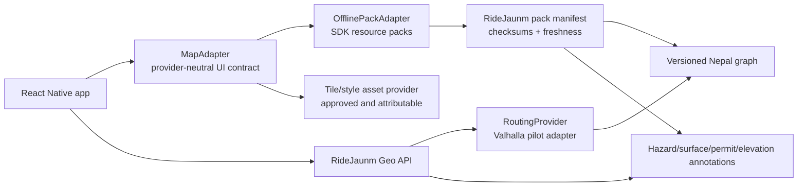

# ADR-001 Decision Packet — Geospatial, Routing, and Offline Maps

> **Decision:** Choose the initial map-rendering, routing, and offline-pack architecture for Nepal.  
> **Status:** Accepted — pilot only (2026-08-19).  
> **Parent record:** [ADR-001](15-architecture-decision-records.md#adr-001--geospatial-platform-and-licence-model).

## 1. Decision statement

Adopt a **provider-neutral, open-data-first pilot architecture**:

```text
React Native MapAdapter
  ├─ MapLibre React Native renderer + offline-pack manager
  ├─ RideJaunm tile/style/asset provider interface
  └─ Geo API → Valhalla proof-of-concept routing adapter
       └─ versioned OSM-derived Nepal graph + RideJaunm annotations
```

This is a decision to validate an architecture, **not** a final production-provider or licence purchase. A managed map/routing platform remains an explicit benchmark and fallback until the pilot gates below pass.

## 2. Why this option fits RideJaunm

| Requirement | Pilot approach |
|---|---|
| React Native map UI | `MapAdapter` hides renderer/provider details from screens and route UI |
| Offline base map | MapLibre React Native offline packs provide a region, zoom range, style, asynchronous progress, and cache/pack management |
| Offline pack truth | RideJaunm manifest/checksum/freshness layer remains authoritative over generic SDK “complete” state |
| Three route modes | Valhalla is evaluated for a motorcycle cost profile plus server-side RideJaunm constraints/annotations |
| Nepal data provenance | OSM-derived graph is versioned; hazard/surface/permit layers retain source and freshness independently |
| Future provider switch | `MapAdapter`, `RoutingProvider`, and `PackAssetProvider` prevent provider identifiers from leaking into domain models |

MapLibre’s React Native OfflineManager can create offline packs from style, bounds, and zoom levels, report progress/errors, list packs, invalidate content, and manage cached resources. Its host’s terms still govern downloaded tiles, so RideJaunm must operate its own approved tile/style source or contractually approved host. [MapLibre OfflineManager](https://maplibre.org/maplibre-react-native/docs/modules/offline-manager/)

Valhalla is an MIT-licensed routing engine designed for OpenStreetMap data. Its tiled structure and dynamic costing make it a strong candidate for regional extracts and route-profile experimentation; its documentation also marks motorcycle costing as beta, so route quality must be field-validated rather than assumed. [Valhalla overview](https://valhalla.github.io/valhalla/) · [routing API and costing](https://github.com/valhalla/valhalla-docs/blob/master/turn-by-turn/api-reference.md)

OpenStreetMap data is distributed under ODbL. RideJaunm must show OpenStreetMap attribution, identify the data licence, preserve applicable share-alike obligations for any distributed derivative database, and complete legal review before launch. It must not rely on public OSM tile/API infrastructure as a production service. [OpenStreetMap copyright and licence](https://www.openstreetmap.org/copyright)

## 3. Managed-platform benchmark

A managed mobile-map platform is retained as a benchmark for speed, visual quality, terrain/search quality, support, and operational burden. For example, Mapbox documents native iOS/Android offline region downloads containing styles, tiles, fonts, and icons; it also documents a cumulative 750 unique tile-pack limit and MAU-based billing for offline resources. This makes it a legitimate feasibility comparator, but not an unreviewed default for a pack-heavy Nepal riding application. [Mapbox offline maps](https://docs.mapbox.com/help/dive-deeper/mobile-offline/)

| Option | Strength | Critical risk | Recommended role |
|---|---|---|---|
| Open-data-first pilot: MapLibre + OSM + Valhalla | maximum routing/provenance control; no renderer lock-in | graph/tile operations and motorcycle-route tuning | **Primary validation path** |
| Managed map/routing platform | quickest high-quality initial integration | licence/cost/pack constraints and provider coupling | benchmark + documented fallback |
| Hybrid adapter model | enables measured transition | two systems if retained too long | architecture rule, not a temporary duplicate implementation |

## 4. Architecture boundaries



The client does not calculate a global route. It may render and navigate an eligible route corridor from a verified downloaded pack. The server owns graph builds, candidate generation, source provenance, and pack-manifest issuance.

## 5. Pilot scope

The pilot is deliberately limited to a representative Nepal test set defined with local riders before any public claim:

1. one urban/valley corridor;
2. one highway-to-hill corridor;
3. one low-connectivity, terrain-sensitive corridor;
4. one corridor with an explicit restriction, closure, or unavailable-coverage case.

For each corridor, test Straight, Curvy, and Supercurvy candidates against rider-reviewed expectations. Supercurvy may return unavailable when legal access, graph coverage, hazard, surface, or confidence constraints are insufficient.

### Required pilot deliverables

- reproducible OSM-derived Nepal graph build and a graph-version registry;
- approved tile/style source with visible attribution and written licence terms;
- `RoutingProvider` adapter that returns all candidate metadata and explicit unavailable reasons;
- `MapAdapter` with region/corridor pack download, resume, checksum verification, stale/partial state, and offline rendering on iOS and Android;
- selected source, hazard, surface, permit, elevation, and coverage annotations with provenance;
- field evidence from riders and physical devices, including low-connectivity/offline operation;
- a managed-platform benchmark matrix with no production credentials embedded in the app.

## 6. Acceptance scorecard

The pilot is accepted only if every hard gate passes. Weighted scoring cannot compensate for a failed safety/legal/offline hard gate.

| Category | Weight | Hard gate | Evidence |
|---|---:|---|---|
| Offline rendering and packs | 25% | verified region/corridor renders after network loss on iOS + Android | device recording, manifest and checksum logs |
| Route legality and safety | 25% | no candidate ignores known hard restriction; unsupported case is explicit | reviewed regression set and field ride notes |
| Nepal route quality | 20% | rider panel accepts agreed test results for each supported mode | blind comparison and issue log |
| Provenance/licence | 15% | attribution, source version, freshness, and legal review complete | UI capture, manifest, licence checklist |
| Operations/cost | 10% | graph/pack build is reproducible and within approved pilot budget | build runbook and cost estimate |
| Provider portability | 5% | alternative map/routing adapter can be stubbed without UI/domain-model change | interface/contract test |

### Required negative tests

- request Supercurvy where coverage or restrictions make it invalid;
- interrupt a pack download, resume, and verify no partial pack is marked complete;
- use a stale hazard layer with a fresh base map and verify the UI distinguishes both;
- remove connectivity before map launch and verify only cached/verified resources render;
- change graph version and verify saved routes retain prior graph provenance;
- simulate provider/tile failure and verify explicit degraded state with no unlicensed public fallback.

## 7. Interfaces to implement

```ts
export interface MapAdapter {
  render(input: MapRenderInput): Promise<void>;
  setCamera(camera: MapCamera): Promise<void>;
  setNetworkPolicy(policy: 'online' | 'cache-only'): Promise<void>;
}

export interface OfflinePackAdapter {
  start(plan: OfflinePackPlan): Promise<OfflinePackJob>;
  resume(jobId: string): Promise<void>;
  inspect(jobId: string): Promise<LocalPackVerification>;
  remove(jobId: string): Promise<void>;
}

export interface RoutingProvider {
  candidates(request: RouteCandidateRequest): Promise<RouteCandidateResult>;
  graphVersion(): Promise<GraphVersion>;
}
```

`LocalPackVerification` must report per-layer presence, checksum status, source/graph version, and freshness. An SDK download-complete callback alone is insufficient for a RideJaunm `complete` state.

## 8. Data and licensing rules

- Store `source`, `sourceVersion`, `licence`, `attribution`, `ingestedAt`, `freshUntil`, and reviewer status for each imported/published geographic layer.
- Keep OSM attribution visible in the map UI and include ODbL information in product/legal surfaces according to the final legal review.
- Do not use the public OSM tile servers or public routing demos as a production dependency.
- Do not merge source data with incompatible terms without a licence compatibility review.
- Keep base map, route graph, closures/hazards, and community reports on separate freshness clocks.

## 9. Rollout and rollback

| Stage | Feature flag | Rollback |
|---|---|---|
| Internal map rendering | `maps.maplibre.enabled` | fixture map surface |
| Pilot routing | `routing.valhalla_pilot.enabled` | fixture candidates / managed benchmark adapter |
| Pilot packs | `offline.pilot_packs.enabled` | disable new plans; retain verified existing packs read-only |
| Public feature | country/region/profile flags | disable profile/region; do not erase user-owned verified assets without consent |

Every rollout records graph/style/manifest versions. Rollback preserves historical route records and explicitly marks a feature/pack stale or unavailable rather than rewriting history.

## 10. Approval record and scope

**Approved on 2026-08-19:** the open-data-first pilot and its validation gates.

This approval authorizes feasibility implementation only. It does **not** authorize a paid-provider commitment, public production use, production emergency claims, or use of unreviewed geographic data. Each of those needs a subsequent documented decision and the evidence specified in this packet.
