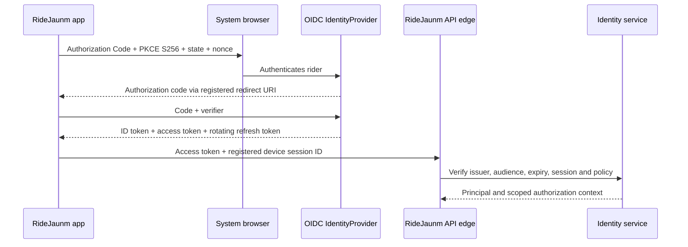

# ADR-002 Decision Packet — Identity and Device Sessions

> **Decision:** Select the identity and device-session model for RideJaunm mobile clients and backend services.  
> **Status:** Accepted — provider-neutral (2026-08-19).  
> **Parent record:** [ADR-002](15-architecture-decision-records.md#adr-002--identity-and-device-session-boundary).

## 1. Decision statement

Adopt a **provider-neutral OIDC/OAuth 2.0 mobile boundary**:

```text
React Native app
  → system browser authorization-code flow with PKCE (S256)
  → OIDC-compatible IdentityProvider adapter
  → short-lived, audience-restricted access token
  → rotating refresh token bound to a registered device session
  → backend resource authorization (never client role claims alone)
```

The identity-provider implementation stays behind an adapter. This approves the protocol and session architecture, not a managed-provider contract or a specific social-login catalogue.

## 2. Standards and product rationale

The OAuth native-app best current practice uses an external user-agent—the system browser—not an embedded web view. That protects browser authentication state and avoids letting the app directly handle provider credentials. [RFC 8252](https://www.rfc-editor.org/info/rfc8252/)

OAuth security BCP requires PKCE support and specifies that public-client refresh tokens must be sender-constrained or use refresh-token rotation. RideJaunm therefore uses per-transaction `state`, `nonce`, and PKCE S256; refresh-token reuse revokes the affected device session. [RFC 9700](https://www.rfc-editor.org/rfc/rfc9700.html)

OpenID Connect provides the interoperable identity layer on top of OAuth 2.0. The platform stores a minimal internal identity mapping; it does not treat unverified client profile fields as account authority. [OpenID Connect Core](https://openid.net/specs/openid-connect-core-1_0.html)

## 3. Architecture



### Roles of each component

| Component | Responsibility | Must not do |
|---|---|---|
| Mobile app | starts browser flow, stores session secrets in platform secure storage, registers device metadata | use a client secret, trust a local role, or issue app-wide credentials |
| Identity provider | authenticates end user and issues standards-compliant tokens | authorize access to RideJaunm trips, incidents, or locations |
| API edge | validates issuer/signature/audience/expiry, request quotas, correlation ID | translate a token claim directly into resource access |
| Identity service | maps external subject to internal user/device/consent/session state | store unnecessary provider profile data |
| Authorization policy | decides each resource action from server data and consent | trust client-provided group role/location claim |

## 4. Token and session model

| Item | Rule |
|---|---|
| Authorization flow | authorization code flow with PKCE S256 in system browser; exact registered redirect URI |
| Access token | short-lived, audience-restricted to RideJaunm resource servers, minimal scopes |
| ID token | used to establish/verify identity response; not used as a general API authorization token |
| Refresh token | one rotating family per registered device session; encrypted at rest in platform secure storage |
| Rotation/reuse | every refresh rotates; detected reuse revokes the token family/device session and requires sign-in |
| Device session | UUID, user, platform, app version, public key/capability metadata, created/last-used/revoked timestamps |
| Logout/revocation | removes local secrets, revokes device session server-side, queues safe cleanup if offline |
| Offline state | existing cached data remains according to local policy; new protected server actions wait for reauthentication/connectivity |

No token carries authoritative trip/group roles, precise location, emergency-contact fields, or medical-card fields. The server calculates those permissions at request time.

## 5. Device integrity and capability evidence

Device integrity is an **anti-abuse signal**, not proof of a rider’s identity, safety status, or delivery of an SOS. On Android, Play Integrity can help a backend assess whether requests came from the genuine app binary on a genuine/certified device; use it only where it improves risk decisions and design a usable fallback for devices that cannot supply a verdict. [Android Play Integrity overview](https://developer.android.com/google/play/integrity)

| Evidence class | Example use | Cannot prove |
|---|---|---|
| Registered device session | revoke a lost phone, bind refresh family, audit device activity | that the current user is physically holding the device |
| App/device integrity verdict | raise risk/step-up authentication for sensitive actions | identity, group membership, emergency delivery |
| OS permission snapshot | decide whether the app may attempt GPS/notifications | actual location accuracy or notification receipt |
| Local peer/mesh capability | render truthful capability UI | provider delivery or emergency response |

Initial scope: record device capability metadata and feature-flag integrity verification for abuse-sensitive actions. Do not block emergency incident creation solely because a mobile integrity signal is unavailable.

## 6. Internal contracts

```ts
type DeviceSession = {
  id: string;
  userId: string;
  platform: 'ios' | 'android';
  appVersion: string;
  capabilitySnapshot: Record<string, unknown>;
  integrityLevel: 'unknown' | 'advisory' | 'verified' | 'rejected';
  createdAt: string;
  lastUsedAt: string;
  revokedAt?: string;
};

type AuthorizationContext = {
  userId: string;
  deviceSessionId: string;
  scopes: string[];
  authenticationAgeSeconds?: number;
  riskLevel: 'normal' | 'elevated' | 'blocked';
  requestId: string;
};
```

Required endpoints:

| Endpoint | Behaviour |
|---|---|
| `POST /v1/devices` | registers device metadata after valid identity/session verification |
| `GET /v1/devices` | lists the rider’s own sessions with safe device metadata |
| `POST /v1/devices/{id}/revoke` | revokes a session; user may revoke only their own device |
| `GET /v1/me` | returns RideJaunm profile/consent state, not raw provider profile by default |
| `PATCH /v1/me` | updates product profile under validation/audit |
| `GET/PUT /v1/safety-profile` | requires authenticated rider and protected-field/audit rules |

## 7. Security and privacy controls

- Use system-browser authorization; prohibit embedded password collection and public-client secrets.
- Validate `iss`, `aud`, signature, expiry, `state`, `nonce`, and PKCE verifier according to the selected provider and standards.
- Use exact redirect URIs and reject unauthorized app links/deep links.
- Store refresh/session secrets only in platform secure storage; never in analytics, logs, crash reports, or normal database tables.
- Maintain revocation, rotation/reuse-detection, suspicious-login/rate-limit, and security-event audit records.
- Limit access-token scope and audience to the necessary RideJaunm service boundary.
- Encrypt/purpose-audit medical and emergency-contact fields independently of identity token security.
- Require fresh authentication or step-up according to policy before high-risk changes such as emergency-contact or account-deletion operations.

## 8. Acceptance tests

| Test | Required result |
|---|---|
| Native sign-in | uses system browser and PKCE S256; no embedded credential screen |
| Redirect attack | unregistered/mismatched redirect, state, nonce, issuer, or audience is rejected |
| Refresh reuse | replay revokes the affected device-session family and alerts/audits safely |
| Device revoke | revoked session cannot refresh or call protected APIs |
| Resource authorization | member/non-member, former member, and client-forged role attempts are correctly denied |
| Offline recovery | cached local content follows policy; queued protected writes wait/retry honestly |
| Integrity degraded | user can use allowed flows when integrity is unknown; abuse-sensitive policy is explicit |
| Protected profile | safety/medical/contact reads and writes create purpose-bound audit records |

## 9. Decision alternatives

| Option | Decision |
|---|---|
| Managed OIDC provider | allowed implementation of the adapter after separate cost/data-residency approval |
| Self-hosted OIDC server | allowed if operational/security ownership is accepted |
| Embedded web-view login | rejected for native-app authorization |
| Long-lived bearer token without rotation | rejected |
| Client-side group-role authorization | rejected |
| Mandatory integrity gate for all users/SOS | rejected; integrity is risk evidence, not universal identity proof |

## 10. Approval record and scope

**Approved on 2026-08-19:** the standards-based, provider-neutral identity and device-session architecture.

This approval authorizes contract and feasibility implementation only. It does **not** select an identity provider, enable a production social-login channel, or approve retention of unneeded identity data.
