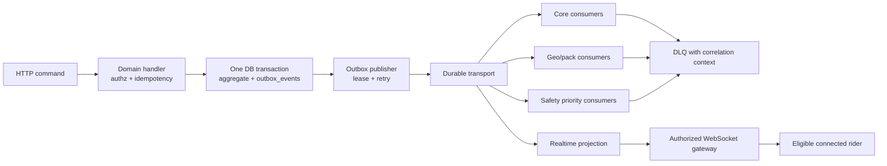

# ADR-004 Decision Packet — Durable Events and Realtime

> **Decision:** Define RideJaunm’s durable-event, worker, and realtime-presence architecture.  
> **Status:** Accepted — provider-neutral (2026-08-19).  
> **Parent record:** [ADR-004](15-architecture-decision-records.md#adr-004--durable-events-and-realtime-transport).

## 1. Decision statement

Adopt a **transactional outbox + provider-neutral at-least-once durable transport + idempotent consumer** model. Use an authorized WebSocket gateway only for ephemeral presence/delivery fan-out; it never becomes the sole durable record. Isolate safety event processing in dedicated priority queues and worker capacity.

```text
Command → relational transaction (domain change + outbox event)
        → outbox publisher → durable event transport → idempotent consumers / DLQ
Realtime: authorized WebSocket channels ← durable/TTL-backed projections
Safety: dedicated priority topic/queue + worker pool + audit ledger
```

This selects event semantics and boundaries, not a broker vendor.

## 2. Rationale

CloudEvents provides a common, protocol-agnostic event metadata/envelope model; RideJaunm uses a compatible envelope with project-specific schemas/versioning. [CloudEvents specification](https://github.com/cloudevents/spec)

Durable streams are generally at-least-once, so consumers must tolerate duplicate delivery. For example, NATS JetStream documents at-least-once as the base stream quality and describes duplicate/re-delivery scenarios; this confirms that application-level idempotency remains necessary even if a selected broker offers additional features. [NATS JetStream delivery semantics](https://github.com/nats-io/nats.docs/blob/main/nats-concepts/jetstream/README.md)

WebSocket is appropriate for two-way realtime communication, but delivery on a connection is not a durable business guarantee. RideJaunm must retain durable state in the database/outbox, then project it to authorized clients. [WebSocket protocol](https://www.rfc-editor.org/info/rfc6455/)

## 3. Event flow



### Transactional outbox rules

1. Validate request version, authentication, authorization, and `Idempotency-Key` before mutation.
2. Write the domain record, command-idempotency result, and `outbox_events` row in the same transaction.
3. Publisher leases unpublished outbox rows; a lease expiry makes interrupted work safely retryable.
4. Transport publication is at-least-once. Consumers persist `event_id`/effect idempotency before or atomically with their effect.
5. A failed consumer retries with jitter only when classified retryable; exhausted/poisoned events enter a DLQ.
6. Replay never changes historical incident facts; new facts supersede visible projections.

## 4. Event contract

```json
{
  "specversion": "1.0",
  "id": "uuid",
  "source": "ridejaunm://core/trips",
  "type": "trip.invited.v1",
  "time": "2026-08-19T12:34:56Z",
  "datacontenttype": "application/json",
  "subject": "trip/uuid",
  "correlationid": "req_01...",
  "causationid": "command-or-event-uuid",
  "data": { "schemaVersion": 1 }
}
```

Required fields: stable event `id`, `type`, producer `source`, occurrence time, subject, correlation/causation IDs, schema version, privacy classification, and payload. Payloads contain only the data a consumer needs; they must not place unnecessary precise location, medical/contact, or token data on broad topics.

| Family | Examples | Ordering / privacy rule |
|---|---|---|
| Core | `trip.invited.v1`, `ride.started.v1`, `message.queued.v1` | partition/order by aggregate where required |
| Geo | `route.saved.v1`, `offline.pack.published.v1`, `hazard.updated.v1` | include graph/source/freshness version |
| Presence | `group.presence.changed.v1` | TTL projection; not a durable “live” claim |
| Safety | `incident.created.v1`, `incident.channel-attempted.v1`, `incident.acknowledged.v1`, `incident.stood-down.v1` | dedicated priority path, immutable evidence |

## 5. Realtime protocol

### Channel naming and authorization

| Channel | Subscriber policy | Payload requirements |
|---|---|---|
| `trip:{tripId}` | active trip member only | membership/version, non-sensitive trip updates |
| `ride:{rideId}:presence` | active ride member + location scope | source, accuracy, observed/received time, `lastSeenAt`, freshness |
| `conversation:{id}` | active conversation member | queued/sent/failed delivery state, no unauthorized attachments |
| `incident:{id}` | incident subject, authorized contact, or audited privileged role | evidence-state transition only |

Handshake verifies token/session and evaluates current resource policy. Subscription authorization is rechecked on token expiry, membership changes, and sensitive-scope changes. WebSocket connections use heartbeats, bounded payload sizes, per-user/channel quotas, reconnect backoff, and explicit protocol versions.

### Presence state

```text
fresh heartbeat → live
no current heartbeat but within grace period → delayed
TTL exceeded → stale
no permitted/current record → unavailable
```

Presence record fields include `memberId`, source/transport, device-observed and server-received times, accuracy, location scope, sequence number, and expiry. It is never a substitute for a durable ride history or incident record.

## 6. Safety priority isolation

| Concern | Rule |
|---|---|
| Transport | dedicated safety stream/topic/queue and credentials |
| Consumers | separately scaled worker pool and DLQ/alerts |
| Rate controls | safety-aware anti-abuse policy; a retry must not be silently blocked as spam |
| Audit | incident facts and channel attempts are immutable, correlated, and exportable |
| Realtime | notification is an assist; durable evidence is the source of truth |
| Failure | provider/worker failure appends an explicit failed/unknown attempt; no false sent/received claim |

Community media, feed fan-out, pack builds, and analytics must have independent quotas and cannot consume safety priority capacity.

## 7. Broker selection requirements

The selected transport may be a managed queue/stream or a self-managed broker only if it supports:

- durable acknowledged delivery, consumer replay, explicit retention, and DLQ/retry design;
- message encryption/access control, service/workload identity, and audited administration;
- partitioning/order for aggregate-specific transitions;
- separate safety priority capacity and back-pressure visibility;
- metrics for publication, consumer lag, retries, redeliveries, and DLQ age;
- a portable adapter so transport-specific SDK types do not enter domain code.

`FOR UPDATE SKIP LOCKED` may be used by the outbox publisher to reduce lock contention among multiple workers, but it is a queue-work coordination mechanism—not a replacement for durable event semantics or consumer idempotency. [PostgreSQL locking documentation](https://www.postgresql.org/docs/current/sql-select.html)

## 8. Failure and recovery matrix

| Failure | Behaviour |
|---|---|
| API response lost after commit | repeated command returns stored idempotent result |
| Publisher crashes after broker publish | event may publish again; consumer deduplicates by event ID |
| Consumer crashes after effect but before acknowledgement | broker redelivers; effect record prevents duplicate action |
| Realtime disconnect | client reconnects and fetches authoritative state; old presence becomes stale |
| Ordered update arrives late | aggregate version/sequence detects outdated projection; client refetches |
| Safety provider times out | record `unknown`/`failed` attempt by evidence; schedule configured retry/failover |
| DLQ growth | alert, classify, replay via audited controlled action; never blindly mass-replay safety events |

## 9. Acceptance tests

- concurrent duplicate writes produce one domain outcome and one logical external effect;
- crash/restart at every outbox publish/consumer acknowledgement boundary;
- consumer replay is idempotent for invitations, chat notification, pack publication, and incident channel attempt;
- unauthorized or removed member cannot subscribe/read after policy change;
- presence transitions live → delayed → stale → unavailable correctly under dropped heartbeats;
- large/invalid WebSocket payload, stale token, subscription flood, and reconnect storm are limited;
- a media/pack backlog cannot delay safety consumer handling;
- DLQ and replay preserve correlation IDs and operator audit evidence.

## 10. Decision alternatives

| Option | Decision |
|---|---|
| Transactional outbox + durable at-least-once transport + idempotent consumers | **recommended** |
| Direct synchronous service-to-service notification as the only record | rejected |
| WebSocket message as durable business state | rejected |
| Exactly-once assumption without application dedupe | rejected |
| Shared unrestricted queue for safety and social/media | rejected |
| Polling-only presence for the active group ride | rejected for primary experience; retained as degraded fallback |

## 11. Approval record and scope

**Approved on 2026-08-19:** the provider-neutral outbox, durable-event, realtime, and safety-priority architecture.

This does **not** select a broker, define retention windows, or approve a production notification provider.
