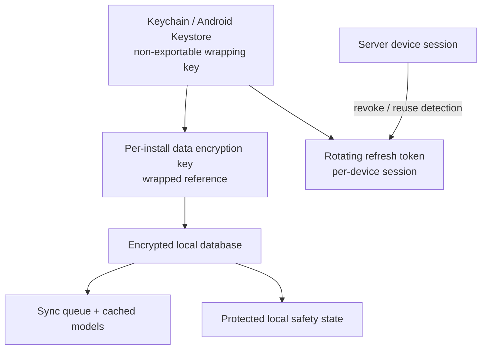

# ADR-005 Decision Packet — Encrypted Mobile Local Store

> **Decision:** Define the security boundary and lifecycle for RideJaunm’s offline mobile state.  
> **Status:** Accepted — provider-neutral (2026-08-19).  
> **Parent record:** [ADR-005](15-architecture-decision-records.md#adr-005--mobile-encrypted-local-store-approach).

## 1. Decision statement

Adopt a **two-layer, provider-neutral local-storage architecture**:

```text
Platform secure store (Keychain / Android Keystore)
  → small secrets only: rotating refresh token, installation wrapping key, device-session reference
  → wraps / unlocks
Encrypted structured local database
  → sync operations, cached domain read models, route metadata, protected local state
App-private asset files
  → checksum-verified pack tiles/graphs/styles and media cache, with manifest policy
```

Use a native-backed encryption adapter and migration-tested structured database. Do not select a React Native package merely because it exposes an encrypted key-value API.

## 2. Rationale

Apple Keychain Services provides an encrypted keychain for small secrets and cryptographic keys. [Apple Keychain Services](https://developer.apple.com/documentation/security/keychain-services)

Android Keystore keeps key material non-exportable even if an attacker reads internal storage, although a compromised device can still use keys on that device. This reinforces the design rule that local protection complements, but never replaces, server authorization and revocation. [Android Keystore](https://developer.android.com/privacy-and-security/keystore)

OWASP recommends platform secure storage, encrypted private data at rest, no hard-coded credentials, backup exclusion for sensitive data, and server-side authorization. [OWASP mobile security guidance](https://cheatsheetseries.owasp.org/cheatsheets/Mobile_Application_Security_Cheat_Sheet.html)

## 3. Data classification and placement

| Class | Examples | Local location | Lifecycle |
|---|---|---|---|
| S0 — public/cacheable | style assets, public tile resources, app configuration | app-private files/cache | removable/re-downloadable |
| S1 — rider private | profile projection, saved routes, group roster, queued post/message | encrypted database | purge on logout/account removal according to policy |
| S2 — protected | refresh token, device-session reference, medical/emergency-contact projection, recent precise location | secure store for secrets; encrypted DB for necessary projections | minimize; redacted logs/backups; purge/rotate on revoke |
| S3 — safety evidence | local SOS draft/timeline and capability snapshot | encrypted database with short explicit retention | preserve only policy-required records; never claim remote delivery |

Never store a password, provider client secret, provider private key, or long-lived backend credential in the mobile bundle or normal application storage.

## 4. Key hierarchy and session lifecycle



1. On first authenticated setup, create or obtain an installation data-encryption key without exposing raw key material to JavaScript/application logs.
2. Store the key/wrapping material through the platform secure-store adapter; the structured database uses the key only through its native encryption integration.
3. Store the rotating refresh token/session reference in the secure store, never in the database, analytics, crash reporting, or a plain preferences store.
4. On server-side device-session revocation, remove local session secrets at the next app contact; sensitive server writes are blocked until reauthentication.
5. On explicit logout or account removal, purge S1–S3 account-bound data and keys. S0 assets may be retained only if not account-bound and the user has not requested a full local-data deletion.
6. Key loss, operating-system reset, or a failed integrity/migration check means the app purges unreadable local protected data and rehydrates safely; it never attempts insecure key recovery.

## 5. Offline-pack design

Map SDK resource packs are not enough to represent RideJaunm’s verified offline state. Store a separate encrypted/validated manifest record containing:

```text
pack ID, region/corridor bounds, graph/style/source versions,
asset checksums, per-layer presence, base-map/hazard freshness,
licence/attribution, bytes, verification time, and failure reason
```

- Pack assets reside in app-private storage, not shared/external storage.
- A manifest reports `queued`, `downloading`, `paused`, `partial`, `complete`, `stale`, or `failed`.
- `complete` requires verified required asset checksums; an SDK completion event alone is insufficient.
- Pack files and cached data must not enter OS/cloud backup when sensitive or licence/policy restrictions forbid it.
- If storage is low, evict S0 cache before verified user-selected packs; never silently erase a pack marked available for an active ride.

## 6. Native boundary

```ts
export interface SecureStoreAdapter {
  get(key: string): Promise<string | null>;
  set(key: string, value: string, policy: SecureStorePolicy): Promise<void>;
  remove(key: string): Promise<void>;
}

export interface EncryptedDatabaseAdapter {
  migrate(targetVersion: number): Promise<MigrationResult>;
  transaction<T>(fn: () => Promise<T>): Promise<T>;
  purgeAccount(accountId: string): Promise<PurgeReport>;
  integrityCheck(): Promise<IntegrityResult>;
}

export interface LocalPackStore {
  verify(manifest: PackManifest): Promise<LocalPackVerification>;
  evict(policy: StoragePolicy): Promise<EvictionReport>;
}
```

The React Native layer receives only intended values through these interfaces. Platform-specific access controls, app-unlock policy, and native database encryption live behind the native adapter and must be covered by iOS/Android integration tests.

## 7. Privacy and security controls

- Use app-private storage only; avoid externally readable/shared storage for protected data.
- Disable or explicitly exclude protected local data from OS/cloud backup according to platform capabilities and policy.
- Redact sensitive values from logs, crash reports, analytics, clipboard, keyboard/autofill use, background snapshots, and developer diagnostics.
- Use platform API crypto; do not implement custom cryptographic algorithms or embed keys in JavaScript.
- Treat rooted/jailbroken/compromised device signals as risk input. Preserve offline safety UX where possible, but rely on server authorization/revocation for protected remote actions.
- Make biometric/device-unlock gating optional and additive; always provide an accessible fallback and never treat a biometric result as backend identity.

## 8. Required tests

| Test | Required result |
|---|---|
| Restart recovery | verified pack, queued operation, and active-ride recovery survive normal restart |
| Migration | forward migration and failed-migration handling preserve/restore safe state or purge recoverably |
| Logout/revocation | S1–S3 account data and secure session material are removed/blocked correctly |
| Backup inspection | protected data is absent from unapproved backup/export locations |
| Device loss | server session revoke prevents refresh/protected calls; local data follows encryption policy |
| Pack interruption | partial assets never render as complete; resume/checksum verification succeeds |
| Storage pressure | eviction preserves required/active ride data and presents a truthful error |
| Leak scan | no token/contact/medical/location data appears in logs, analytics, screenshots, or plain files |

## 9. Alternatives

| Option | Decision |
|---|---|
| Platform secure store + encrypted structured DB + app-private assets | **recommended** |
| Plain AsyncStorage/preferences for sensitive state | rejected |
| Secure store as the whole offline database | rejected; unsuitable for large/queryable queue/pack data |
| Encryption key committed in app source/bundle | rejected |
| Third-party store without native/device/migration test evidence | rejected |
| Mandatory biometric unlock for all offline/safety use | rejected; may impair accessibility and emergency use |

## 10. Approval record and scope

**Approved on 2026-08-19:** the local-storage security boundary and validation plan.

This does **not** choose the encrypted-database or secure-store library, define data-retention periods, or approve the production handling of biometric signals.
