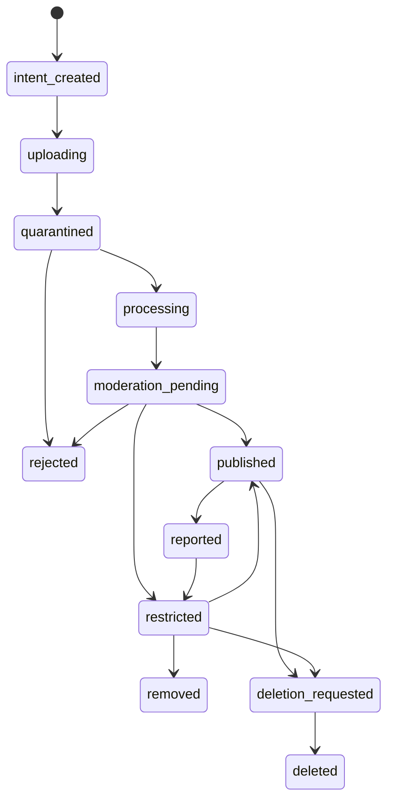
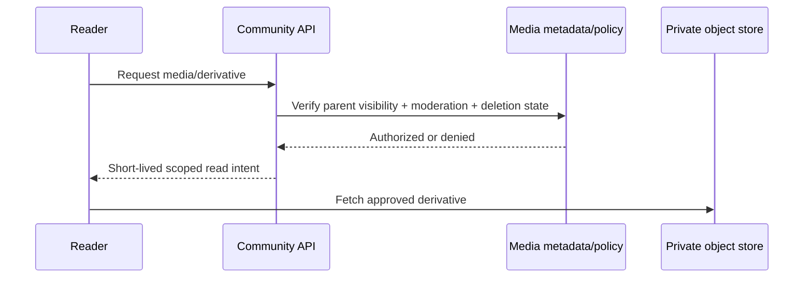

# ADR-006 Decision Packet — Media, Moderation, and Retention

> **Decision:** Define the storage, publication, moderation, and lifecycle boundary for community media.  
> **Status:** Accepted — provider-neutral (2026-08-19).  
> **Parent record:** [ADR-006](15-architecture-decision-records.md#adr-006--community-media-moderation-and-retention).

## 1. Decision statement

Adopt a **private object-store + signed intent + quarantine-before-publish** media architecture. Media is authorized at every upload, processing, and read step; it is not public merely because a rider created it. Publication requires validation and declared moderation state. Retention/deletion periods remain policy decisions.

```text
Create upload intent → direct private upload → quarantine record
  → validate/scan/transcode → moderation state
  → publish authorized derivatives → short-lived read intent
```

## 2. Rationale

OWASP recommends allow-listed file types, server-side type/signature validation, generated filenames, size limits, authorized uploaders, isolated storage, and malware/sandbox review before public release. [OWASP File Upload Cheat Sheet](https://cheatsheetseries.owasp.org/cheatsheets/File_Upload_Cheat_Sheet.html)

Object storage must not be a public authorization bypass. Signed URLs grant time-limited access but do not remove the need for server-side object-level authorization before the URL is issued. [OWASP secure-cloud guidance](https://cheatsheetseries.owasp.org/cheatsheets/Secure_Cloud_Architecture_Cheat_Sheet.html) · [OWASP API object authorization](https://owasp.org/API-Security/editions/2023/en/0xa1-broken-object-level-authorization/)

Logs must record media workflow/security events while excluding tokens, sensitive personal data, and file contents/unsafe paths. [OWASP Logging Cheat Sheet](https://cheatsheetseries.owasp.org/cheatsheets/Logging_Cheat_Sheet.html)

## 3. Media lifecycle



`published` means the media passed the configured technical and moderation gates for its visibility scope; it does not make a private group asset public. `restricted`, `removed`, and `deleted` must cause new read intents to fail immediately according to the policy, even if physical-object cleanup happens asynchronously.

## 4. Upload and read paths

### Upload path

1. Authenticated rider asks `POST /v1/media/intents` with declared purpose, parent resource, type, size, and visibility.
2. API verifies resource policy, quota, allowed type/size, rate limit, and that the parent post/conversation/trip exists.
3. API creates `media_asset` in `intent_created` and returns a short-lived single-purpose upload URL/credential scoped to a generated object key.
4. Client uploads directly to **private quarantine storage**. It never chooses the object key or public ACL.
5. Worker verifies actual type/signature/size/dimensions/duration; scans or safely transforms content; strips/extracts metadata according to policy; creates safe derivatives.
6. Automated/manual moderation assigns `published`, `restricted`, or `rejected` with a reason code/audit record.
7. API issues short-lived scoped read intents only after authorizing the requesting user against current parent visibility and moderation state.

### Read path



Do not return a permanent object URL in feed/message payloads. The UI uses a media state (`queued`, `uploading`, `processing`, `published`, `restricted`, `failed`, `removed`) so riders understand why a file is or is not visible.

## 5. Data model

| Record | Required fields / invariants |
|---|---|
| `media_asset` | ID, owner, parent type/ID, visibility, declared/verified type, bytes, state, retention/deletion policy reference, created/deleted timestamps |
| `media_object` | generated key, bucket/class, checksum, encryption metadata, original/derivative relation, quarantine/publication state |
| `media_processing_job` | asset ID, processor/version, attempt/retry, input/output checksum, result/reason; idempotent |
| `moderation_decision` | asset ID, automated/manual source, policy version, decision, reason code, reviewer/audit context |
| `content_report` | reporter, target, category, safe description, state, outcome, reporter privacy controls |
| `retention_hold` | legal/safety/security hold scope, approved actor, expiry/review; blocks physical deletion only where policy permits |

Object keys are generated UUID/content-addressed values. User file names, private post text, contact details, coordinates, and session tokens are never embedded in object paths or logs.

## 6. Content and privacy policy controls

| Control | Requirement |
|---|---|
| Allow list | initial release supports only explicitly approved image/video formats, dimensions, duration, and sizes |
| Metadata | remove/avoid exposing EXIF GPS by default; treat embedded location as sensitive user data |
| Visibility | `private`, `group`, and only explicitly approved `community` scopes; fine location never derives from a generic feed asset |
| Quarantine | original upload unavailable to readers until validation/processing passes |
| Derivatives | serve sanitized/re-encoded thumbnail/preview where feasible; preserve original only under limited authorized policy |
| Reporting | in-product report/takedown path, review status, user feedback wording, and escalation ownership |
| Rate/quota | per-account/device/group rate, bytes, count, processing, and download controls |
| Abuse | hash/repeat detection, prohibited-content escalation, account restriction pathway, audit evidence |
| Logs | record state/action/reason/correlation IDs; redact contents, URLs, tokens, names, and sensitive metadata |

## 7. Retention and deletion model

The following need product/legal/privacy approval before production; this ADR adopts the mechanism, not the dates.

| Item | Mechanism now | Policy decision later |
|---|---|---|
| Original/derivative media | lifecycle state plus scheduled physical removal | retention duration by visibility/type |
| User deletion | immediate logical deletion and read denial; async object cleanup | grace period and restore policy |
| Reports/moderation evidence | access-restricted audit record | retention and appeal requirements |
| Safety-linked evidence | separate safety/incident policy; not generic community retention | legal/safety retention and export rules |
| Backup copies | encrypted restricted backup with lifecycle | deletion propagation/hold policy |

Deletion is not complete until metadata, derived assets, indexes/search entries, cache/CDN invalidation, and queued processing have all received the deletion state. A legal/safety hold is explicit, auditable, time-bound, and cannot silently republish content.

## 8. Acceptance tests

- forged content type, double extension, oversized image/video, malicious payload, parser error, and processing timeout are rejected/restricted safely;
- a user cannot upload to or fetch from a post/conversation/group they cannot access;
- unscanned/quarantined original cannot be read through guessed keys or stale feed payload;
- changing parent visibility or removing membership immediately denies new read intents;
- EXIF location is not exposed by default in any response/derivative;
- report → review → restrict/remove → appeal/reinstate history is auditable;
- deletion blocks new reads, cancels pending processing, invalidates derivatives/cache, and records cleanup result;
- upload/retry/processing is idempotent and cannot create duplicate published assets;
- media failure/backlog cannot affect SOS, route, or group-presence processing.

## 9. Alternatives

| Option | Decision |
|---|---|
| Private storage, signed intents, quarantine and moderation state | **recommended** |
| Public bucket/object URLs in post payloads | rejected |
| Trust client MIME type or original filename | rejected |
| Publish before scan/processing completes | rejected |
| Generic feed carries media-derived fine location | rejected |
| Delete database metadata but leave accessible derivatives | rejected |
| Embed retention duration without legal/product approval | deferred |

## 10. Approval record and scope

**Approved on 2026-08-19:** the private-media and moderation architecture.

This does **not** select a storage/moderation provider, decide eligible media formats, establish retention durations, or settle Nepal legal/takedown obligations.
