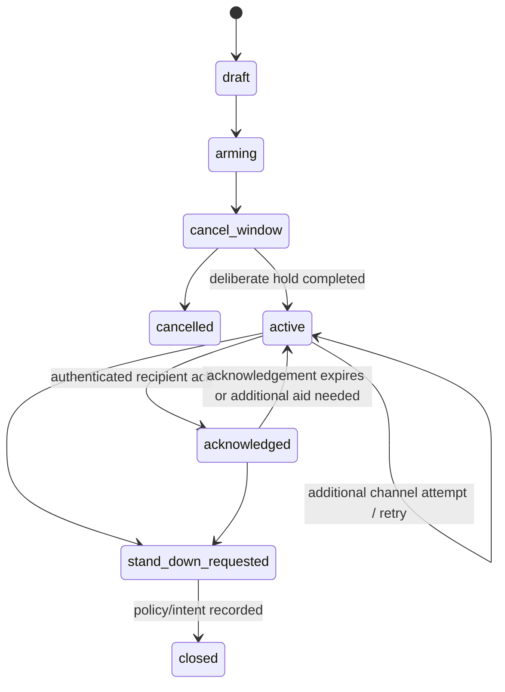
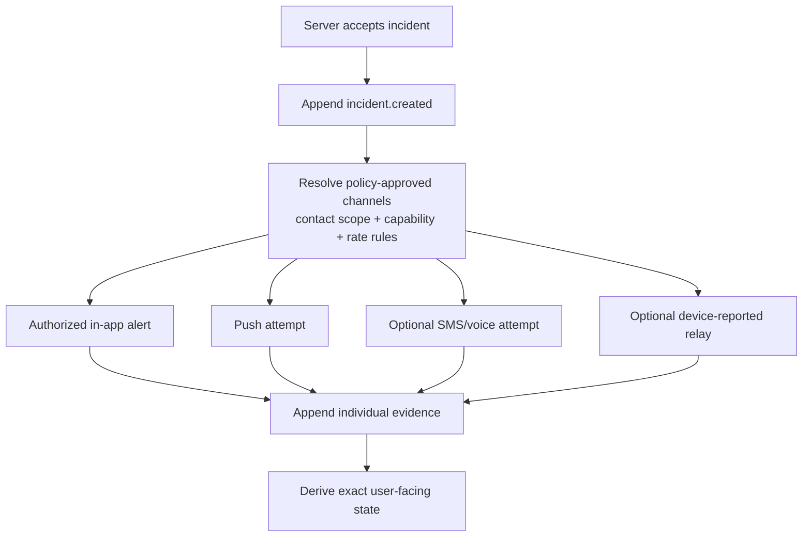

# ADR-007 Decision Packet — SOS Channels and Evidence

> **Decision:** Define the initial SOS capability scope, evidence vocabulary, channel orchestration, and safety operations boundary.  
> **Status:** Accepted — safety boundary (2026-08-19).  
> **Parent record:** [ADR-007](15-architecture-decision-records.md#adr-007--sos-channels-and-evidence-language).

## 1. Decision statement

Adopt a **truthful, evidence-led SOS architecture**. The first release creates a local and server-audited incident, attempts only configured approved channels, records each attempt independently, and distinguishes delivery evidence precisely. It does **not** claim public emergency-service dispatch, satellite rescue, or mesh delivery unless that specific channel is separately validated and approved.

```text
Deliberate device action
  → server incident accepted
  → independent configured channel attempts
  → provider receipt/status where available
  → account-authenticated recipient acknowledgement
  → deliberate stand-down / closure
```

## 2. Non-negotiable language

| Evidence state | Allowed UI wording | Prohibited implication |
|---|---|---|
| `local_recorded` | “SOS recorded on this device” | “Alert sent” |
| `queued_for_server` | “Waiting for a connection to send” | “Help contacted” |
| `server_accepted` | “RideJaunm received your SOS” | “A contact or service has received it” |
| `device_reported` | “Relay reported by a nearby device” | “Relay delivered” |
| `provider_accepted` | “Accepted by [channel provider]” | “A person has seen it” |
| `delivery_unknown` | “Delivery status unknown” | “Delivered” |
| `recipient_acknowledged` | “Acknowledged by [named/authorized recipient]” | “Help is on the way” unless independently confirmed |
| `stand_down_requested` | “All-clear request sent” | “Incident closed” |
| `closed` | “Incident closed” | any claim about real-world response outcome |

Apple documents APNs as best effort: notifications can be throttled, stored, reordered, or not delivered. Consequently, push must never be the sole evidence of a delivered SOS. [Apple APNs documentation](https://developer.apple.com/documentation/usernotifications/sending-notification-requests-to-apns)

Provider callbacks can report transport statuses such as delivered or failed; they do not establish that a human saw, understood, or acted on an alert. [Twilio status callbacks](https://www.twilio.com/docs/messaging/services)

## 3. Initial channel scope

| Channel | Initial use | Evidence ceiling | Release condition |
|---|---|---|---|
| Local encrypted incident/breadcrumb | always available | `local_recorded` | local-store/UX tests |
| Server incident API | when any IP connection is available | `server_accepted` | audited API/outbox/restore tests |
| In-app authorized alert | eligible active group/contact app session | `recipient_acknowledged` only after authenticated action | membership/realtime/reconnect tests |
| Push notification | notify eligible registered device | provider submit/accepted or unknown, depending on provider evidence | physical-device tests; never sole delivery channel |
| SMS/voice provider | optional configured emergency contact notice | provider status only; recipient acknowledgement requires response/action | commercial/legal/provider approval and webhook validation |
| Device peer relay (BLE/mesh/PTT) | feature-flagged experimental assist | `device_reported` / peer acknowledgement only | independent device transport test; no emergency-service claim |
| Satellite or public dispatch | **out of scope** | none | separate legal, provider, device, and operational ADR |

The app may present available device capabilities, but a disabled/untested channel remains unavailable rather than simulated.

## 4. Incident state machine



Status events are append-only. `acknowledged` does not remove `active` risk context; it records that an authorized recipient acknowledged. `closed` records a product incident lifecycle, not a confirmed outcome in the physical world.

## 5. Incident payload and storage model

### Incident creation payload

```json
{
  "incidentId": "uuid",
  "deviceObservedAt": "2026-08-19T12:34:56+05:45",
  "location": {
    "source": "gps|manual|last-known|mesh-relay",
    "accuracyM": 42,
    "observedAt": "2026-08-19T12:34:40+05:45"
  },
  "capabilities": {
    "network": "cellular|wifi|none",
    "peerTransport": "unavailable|available|attempted",
    "batteryPercent": 18
  },
  "consentScope": "safety-profile-v1"
}
```

Location truth is preserved with source, accuracy, device-observed time, server-received time, and transport. Last-known and peer-reported coordinates are labelled as such. A missing/poor location does not prevent a rider from recording/attempting an SOS; it changes the evidence displayed.

| Record | Invariant |
|---|---|
| `incident` | stable ID, rider/device, active lifecycle projection, consent scope, create/close timestamps |
| `incident_status_event` | append-only state transition with actor, reason, correlation ID, time |
| `incident_channel_attempt` | one row per provider/device attempt; channel, target class, request/receipt reference, outcome/evidence, retry/failover relationship |
| `incident_ack` | account-authenticated actor/recipient, channel, timestamp, optional safe note |
| `incident_access_audit` | every privileged/protected incident read with purpose/actor/time |
| `incident_export` | controlled export request, scope, authorization, generated-at checksum |

## 6. Channel orchestration



Rules:

1. Channel plan is evaluated from current consent, emergency-contact, group, capability, and rate policy; never from untrusted client roles.
2. A channel attempt is independently idempotent and receives a correlation ID. Retry/failover creates a new linked attempt rather than overwriting history.
3. Provider webhooks are authenticated/verified and may only advance evidence to the level supported by the provider event.
4. Push, SMS, voice, and peer relay have separate rate/abuse limits and dedicated safety worker capacity.
5. No channel delay/failure blocks the local incident record or another eligible channel.
6. Emergency-contact phone numbers and medical details are decrypted/used only under the incident’s declared consent/purpose; access is audited.

## 7. Deliberate activation and stand-down

- Activation requires the designed deliberate hold/cancel window, accessibility-equivalent alternative, and a final client capability snapshot.
- Local UI writes an encrypted draft before attempting server delivery. If offline, it says queued—not sent.
- Stand-down requires deliberate intent, a reason code, and creates a new append-only event.
- The server sends an all-clear only to channels/recipients eligible under policy and records each resulting attempt separately.
- A rider cannot erase the server incident/audit history through the client UI. Any retention/deletion request follows the later approved safety/privacy policy.

## 8. Safety operations and governance

| Requirement | Minimum control |
|---|---|
| Ownership | named safety/on-call owner and escalation path before enabling external channels |
| Monitoring | channel-attempt success/failure/unknown, queue age, duplicate suppression, ack/stand-down latency |
| Runbooks | provider outage, backlog, webhook verification failure, suspected abuse, privacy request, restoration |
| Exercises | device loss/no signal, push failure, provider callback delay, duplicate create, failover, restore |
| Legal/copy | Nepal counsel review of emergency wording, consent, contact handling, limitations, and service claims |
| Review | independent safety review before any public-channel or peer-transport feature flag is enabled |

NIST guidance emphasizes recording incident status and supporting audit evidence; RideJaunm’s incident ledger keeps those records immutable and separate from ordinary community data. [NIST incident/audit guidance](https://nvlpubs.nist.gov/nistpubs/SpecialPublications/800-171r3/NIST.SP.800-171r3.html)

## 9. Required validation

- physical iOS and Android test for every enabled device capability/channel;
- airplane-mode, no-permission, last-known GPS, low battery, zero-peer, intermittent-network, and duplicated-tap cases;
- no UI state claims a provider or recipient result without matching stored evidence;
- provider webhook signature, replay, duplicate, delayed, failed, and unknown-status tests;
- channel outage/failover and safety-priority queue tests;
- authorized acknowledgement and deliberate stand-down tests, including all-clear channel evidence;
- audit/export/restore test for a complete incident timeline;
- legal/copy/accessibility review in English, Nepali, and Hindi before public enablement.

## 10. Alternatives

| Option | Decision |
|---|---|
| Evidence-led incident ledger and separately audited channel attempts | **recommended** |
| “SOS sent” after button press or local queueing | rejected |
| Push-only emergency alert | rejected |
| Provider status treated as human acknowledgement | rejected |
| Unvalidated BLE/mesh/satellite advertised as rescue capability | rejected |
| Automated public emergency dispatch without formal integration | out of scope |
| Safety dependency on feed/chat/media availability | rejected |

## 11. Approval record and scope

**Approved on 2026-08-19:** the safety evidence architecture and initial channel boundary.

This does **not** authorize a specific SMS/voice/push provider, satellite/mesh transport, public emergency dispatch, or any claim that emergency services have been notified. Those require separate legal, commercial, operational, and physical-device approval.
