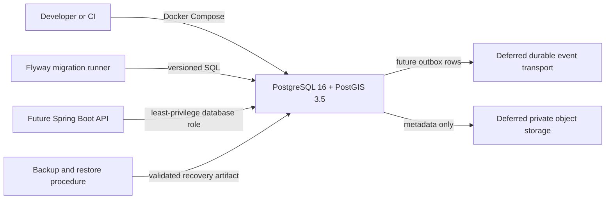

# S2 Data Platform LLD — Draft

> **Status:** Approved design baseline. This defines the data-platform implementation boundary; it does not authorize a Spring Boot scaffold, provider account, or production deployment.
> **Depends on:** S0 architecture readiness and S1 contract foundations.
> **Implements:** S2 — operational data store, geospatial schema, migrations, and backup policy.
> **Read with:** [S1 API/event foundations](27-s1-api-event-contract-foundations.md), [System LLD](13-system-lld.md), [ADR-003](19-adr-003-cloud-network-recovery-decision-packet.md), and [ADR-004](20-adr-004-eventing-realtime-decision-packet.md).

## 1. Decision summary

The pilot data plane uses **PostgreSQL 16 + PostGIS 3.5** with **Flyway SQL migrations**. PostgreSQL is the authoritative store for transactional state, geospatial provenance, idempotency outcomes, audit facts, and the transactional outbox. Docker Compose remains the reproducible local environment.

The selected architecture does not yet choose a managed cloud database, event broker, cache, or object-storage vendor. Their adapters and operational requirements are recorded without becoming runtime dependencies in S2.

## 2. S2 boundary

| S2 provides | S2 does not provide |
|---|---|
| PostGIS-enabled local data plane, schema naming, migrations, common data invariants, outbox persistence, backup/restore evidence | Spring Boot API/controllers, OIDC provider integration, queue/broker selection, Redis/presence, object storage, routing graph ingestion, pack/media implementation, real production data |
| Provenance/freshness columns and spatial conventions | route calculation, live location sharing, group tracking, SOS delivery, notification channel or public-dispatch claim |
| Restore and migration safety rules | production RTO/RPO values, retention durations, cloud/region commitment, real rider/contact data |

## 3. Deployment topology and trust boundary



Rules:

1. The database has no public ingress in any non-local environment.
2. The migration runner is the only principal that can apply DDL; the future API uses a runtime role with no schema-ownership privilege.
3. Application commands write aggregate state, idempotency outcome, audit fact where required, and outbox row in one transaction.
4. Backup/restore credentials are separate from runtime credentials. A runtime compromise must not be able to erase recovery evidence.
5. Local Compose uses synthetic data only and is not a substitute for a production restore plan.

## 4. PostgreSQL namespace and ownership model

Use PostgreSQL schemas as a database-level boundary, aligned with bounded contexts. They improve discoverability and least privilege, but do not replace application-layer authorization.

| Schema | Owns | Initial S2 action |
|---|---|---|
| `platform` | migration metadata, idempotency records, outbox events, audit support, country/profile references | create common tables and constrained enums/checks |
| `identity` | users, device sessions, consent, protected safety-profile references | reserve namespace/common conventions; tables begin in S3 |
| `trip` | trips, groups, memberships, ride sessions | reserve namespace; tables begin in S4 |
| `geo` | source registry, graph versions, coverage, admin regions, roads, hazards, POIs, pack metadata | create spatial/provenance conventions; entities begin in S5 |
| `community` | posts, conversations, messages, media metadata/moderation | reserve namespace; tables begin in S9 |
| `safety` | incidents, immutable transitions, channel attempts, acknowledgements | reserve namespace; tables begin in S10 |

Cross-context records store opaque IDs and immutable reference/version fields. They do not use database foreign keys across schema boundaries unless the receiving context owns the lifecycle of both records. This prevents a foreign-key cascade from becoming an implicit cross-domain business decision.

## 5. Common relational conventions

### 5.1 Identifiers, timestamps, and versioning

| Concern | Rule |
|---|---|
| Primary IDs | UUID generated server-side; public prefixes remain API-display conventions, not database security |
| Time | `timestamptz`, stored as UTC; display time/calendar is an application concern |
| Mutable records | `created_at`, `updated_at`, `version`, `created_by`, `updated_by` where appropriate |
| Append-only facts | `occurred_at`, `actor_type`, `actor_id`, `correlation_id`, `causation_id`; no destructive updates |
| Country policy | `country_code`, `country_config_version` stored when an action/record is governed by a country profile |
| Protected fields | encrypted application value/ciphertext envelope plus key reference; never plaintext in audit/outbox payloads |
| Soft deletion | only where policy permits; deletion/retention state is explicit, audited, and does not erase incident history |

### 5.2 Idempotency records

`platform.idempotency_records` protects every command accepted by the server.

```text
id, actor_id, endpoint_key, idempotency_key, payload_hash,
state, response_status, response_body_reference, resource_type,
resource_id, correlation_id, created_at, completed_at, expires_at
```

Invariants:

- unique `(actor_id, endpoint_key, idempotency_key)`;
- same key plus a different payload hash returns `IDEMPOTENCY_MISMATCH`;
- a replay returns the original accepted outcome, not a second mutation;
- the response reference excludes secrets, medical/contact values, and raw precise coordinates;
- expiration is policy-controlled and cannot be shorter than a supported client retry window.

### 5.3 Transactional outbox

`platform.outbox_events` records a minimized S1 `DomainEvent` in the same transaction as its aggregate change.

```text
event_id, event_type, aggregate_type, aggregate_id, aggregate_version,
classification, country_code, country_config_version, correlation_id,
causation_id, payload_json, occurred_at, publish_state, lease_owner,
lease_expires_at, published_at, attempt_count, last_error_code
```

Required indexes:

- unique `event_id`;
- aggregate order: `(aggregate_type, aggregate_id, aggregate_version)`;
- publisher lease scan: `(publish_state, lease_expires_at, occurred_at)`;
- safety operational visibility: partial/indexed path for `classification = 'safety'`.

The publisher may use `FOR UPDATE SKIP LOCKED` to lease rows, but that does not create exactly-once delivery. The later broker and every consumer remain at-least-once and idempotent by `event_id`.

### 5.4 Audit support

`platform.audit_log` is append-only and records privileged or protected actions without embedding protected payloads.

```text
audit_id, occurred_at, actor_type, actor_id, action, resource_type,
resource_id, purpose, outcome, correlation_id, country_code,
metadata_redacted_json
```

The audit log contains references, reason codes, and redacted metadata—not tokens, emergency contacts, medical data, full message bodies, or precise coordinates unless a separate approved policy requires a protected export.

## 6. PostGIS conventions

### 6.1 Coordinate and type rules

| Use case | PostgreSQL type | Rule |
|---|---|---|
| Canonical point/line/polygon storage | `geometry(..., 4326)` | longitude/latitude axis order; enforce SRID 4326 and valid geometry |
| Radius/distance query in metres | cast to `geography` or use a documented projected calculation | do not treat degrees as metres |
| Rider/incident/location observation | `geometry(Point, 4326)` plus accuracy/source/observed time | protected, purpose-scoped, and never broadly indexed for discovery |
| Administrative/coverage/offline boundary | `geometry(Polygon|MultiPolygon, 4326)` | valid, normalized, versioned, spatially indexed |
| Road/route geometry | `geometry(LineString|MultiLineString, 4326)` | graph/source version and checksum required |

All spatial columns use `NOT NULL` only when the domain actually requires a geometry. A missing coordinate is not represented as `(0,0)` or a fabricated Nepal point.

### 6.2 Required spatial integrity

- validate imported geometry with `ST_IsValid`; quarantine invalid input with reason/provenance rather than silently repairing it;
- use GiST indexes on each queryable spatial column;
- store source, source version, observed/published/ingested times, `valid_from`, `fresh_until`, and review state on imported geo records;
- pin graph and source versions in every route candidate/pack relation;
- separate public aggregate/coverage geometry from protected rider/incident coordinates;
- never use a spatial query alone as authorization to reveal a person, trip, incident, or emergency contact.

## 7. Flyway migration contract

### 7.1 Layout

```text
db/
  migration/
    V20260821_001__platform_schemas.sql
    V20260821_002__platform_idempotency_outbox_audit.sql
    V20260821_003__geo_spatial_conventions.sql
    R__views_and_safe_reference_data.sql
  testdata/
    synthetic-nepal-fixtures.sql
```

Versioned migrations are immutable once shared. Repeatable migrations are restricted to views, safe reference data, or derived database objects that are explicitly reviewed; they must not hide destructive table changes.

### 7.2 Expand, migrate, contract

1. **Expand:** add nullable column/table/index or compatible type; deploy readers that understand both shapes.
2. **Migrate:** backfill in bounded, observable batches; validate counts/checksums and application compatibility.
3. **Contract:** remove old fields only after every supported application version and recovery path no longer depends on them.

Destructive DDL, table rewrites, bulk geo imports, and index changes that may lock a production table require an approved maintenance/rollback plan. The normal rollback is a forward-fix migration; production rollback never assumes Flyway can safely undo arbitrary data changes.

### 7.3 Migration acceptance checks

- blank-database migration succeeds;
- current schema upgrades from the immediately previous supported version;
- migration checksum/history is recorded and immutable;
- PostGIS extension and required schemas/types/indexes exist;
- failed migration leaves a diagnosable state and does not permit the API to claim readiness;
- backup taken before a destructive rehearsal restores into an isolated database and passes integrity checks.

## 8. Backup, restore, and recovery evidence

### 8.1 Local proof now

The existing Docker scripts must prove a local recovery loop using only synthetic data:

1. start the PostGIS Compose service and wait for health;
2. apply migrations;
3. insert a synthetic transactional, geo, idempotency, and outbox sample;
4. create a timestamped backup artifact with checksum and schema version;
5. restore it into a new isolated database/volume—not over the source;
6. verify extension versions, migration history, spatial query/index, sample rows, and outbox/idempotency invariants;
7. record actual duration and failure output.

### 8.2 Production gate later

Production recovery requires a selected managed service or approved self-managed equivalent with encrypted backup, PITR/equivalent, separate access roles, retention policy, and a non-production restore exercise. RTO/RPO values and retention durations remain explicit business/legal decisions under D-01 and D-08.

## 9. Roles and least privilege

| Role | Rights | Must not have |
|---|---|---|
| `ridejaunm_migrator` | create/alter approved schemas, extensions where allowed, migration history | runtime API credential, backup deletion, general production data browsing |
| `ridejaunm_api` | scoped CRUD/function access for implemented modules | DDL, extension management, restore/backup administration |
| `ridejaunm_worker` | only tables/functions needed by leased outbox and assigned module jobs | broad user/profile data access by default |
| `ridejaunm_backup` | create/read verified backup artifacts and restore to controlled target | application mutations or public ingress |
| `ridejaunm_readonly_audit` | approved/redacted audit inspection | protected payload decryption or mutation |

Exact cloud identities and secret manager bindings are deferred to D-01. No password/DSN/secret is committed to the repository.

## 10. S2 completion evidence and open gates

S2 may be marked complete only when all of the following are recorded:

- Compose configuration and PostGIS extension validation pass;
- Flyway migrations execute against a blank database and an upgrade path;
- common conventions, idempotency, outbox, audit, and spatial integrity checks have integration tests;
- a synthetic backup/restore proof restores into an isolated target with recorded duration and integrity evidence;
- no real rider/contact/medical/incident data or provider credentials were used;
- migration rollback/forward-fix procedure and ownership are documented.

Still deferred after S2: identity provider (S3), broker/cache vendor (S4/S8/S10), geo/object vendors (S5–S9), notification providers (S11), and production region/RTO/RPO/retention/on-call decisions (S12/production gate).
